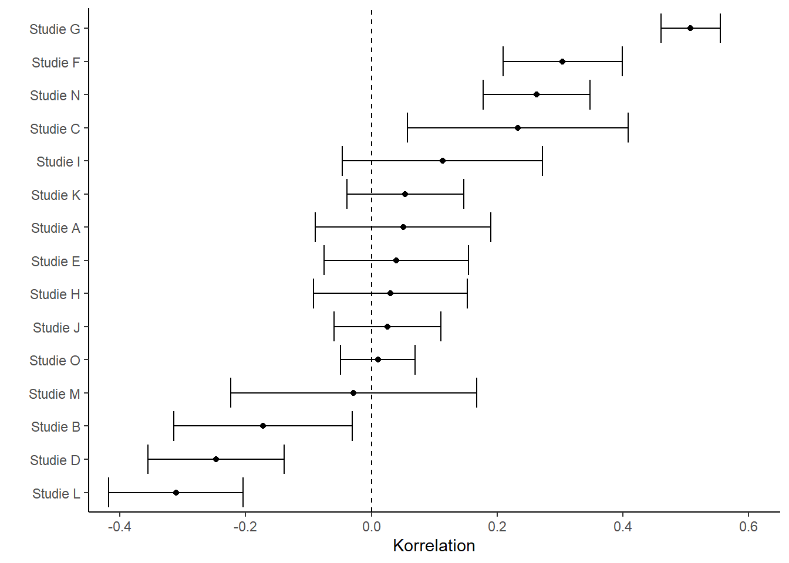

A similar crisis of confidence occurred in social psychology in the 1960s [@Lakens.2023]. A crucial difference between the old crisis and the current one is the stocktaking that has taken place: parallel to the peculiar findings on Bem's precognition studies, psychologists around Brian Nosek formed an international network and investigated the replicability of 100 studies from prominent psychology journals [@OpenScienceCollaboration.2015]. They found that only 39 of the 100 original findings could be replicated. For all other studies, the replication results differed from the original results. Many further large-scale projects followed, all with similar results: replication rates fell far below what had been hoped for.

::: callout-note
## A critical look at the Open Science Collaboration, 2015

Although this "Reproducibility Project: Psychology" shook the entire field to its core and paved the way for a paradigm shift, some researchers also point to negative effects on subsequent replication research. By publishing 100 studies simultaneously through a group of more than 100 researchers, the project set unrealistic standards for replication research. At the same time, quality control was less rigorous, since the individual studies could not all be reviewed to the extent that would have been the case for a traditional publication, e.g. [@Roseler.2022d]. Some equally ambitious projects have since been published, such as the Many Labs studies, e.g. [@Klein.2014; @Klein.2018], or attempts in which independent groups tested and replicated the same hypotheses [@Landy.2020]. Such projects are often limited to studies that can be replicated within an online survey. Formats such as longitudinal studies or behavioral observations are underrepresented due to the greater practical difficulty involved.
:::

Numerous consortia followed. Some projects focused on individual phenomena. For example, 17 research groups joined forces to replicate the *facial feedback* finding [@Strack.1988] in [@Wagenmakers.2016]. In this experiment, participants hold a pen in their teeth, and depending on the pen's orientation, they either tense the muscles used for smiling or do not. In the "smiling" condition, participants subsequently rated comics as funnier. The replication failed. In 2022, a further study with more than 3,000 participants from 19 countries was published -- this time with direct involvement from Fritz Strack, who had conducted the original study [@Coles.2022]. Again, it was shown that the position of a pen in the mouth has no effect on the evaluation of stimuli. Beyond social-psychological findings, researchers also focused on areas such as research with infants [@byers2020building] or studies from specific journals [@Camerer.2018].

### Defining replicability

Determining what could and could not be replicated is only possible once *replication success* has been defined. In common usage among researchers, "was replicated" means that a study investigating the same research question arrived at results similar to those of an original study. Replication failures are described as "could not be replicated." Subtly different from this, "was not replicated" can mean that no replication attempts exist, or that they could not even be conducted because the original study failed to adequately describe key details [@Errington.2021]. For a science that is over 100 years old, it seems surprising that there is still no clear definition of key concepts surrounding replication, let alone that replicating studies has become routine. While different fields have settled on divergent taxonomies -- that is, models for classifying different types of replication -- terms related to *replication* are used in this book as described in the table below. Depending on whether the same or different data and the same or different analyses are used, we speak of reproducibility, replicability, robustness, or generalizability.

| | | **Data** | |
|-------------|-----------------|----------------|-------------------|
| | | same | different |
| **Analysis** | same | reproducible | replicable |
| | different | robust | generalizable |

: Replication taxonomy following the Turing Way [@turingwaycommunity2024illustrations].

::: callout-note
## Statistical comparison of original and replication findings

Every measurement carries some degree of imprecision. In the social sciences, measuring properties or phenomena such as decision-making heuristics is extremely difficult. When original results are compared with replication results, both results carry this imprecision. This makes it difficult to say whether differences arose from random fluctuation or from problems with the original study. There are numerous statistical methods for comparing the two results. They typically differ in how much they account for the imprecision of the original study. Because of older methodological standards, original results tend to be extremely imprecise, and the more heavily they are weighted, the more favorable the comparison turns out -- that is, the higher the estimated replication rate. Depending on the method used, replication rates can then range between 40% and 80%. A comparison of criteria against the FORRT replication database is [available online](https://forrt.org/FReD/articles/success_criteria.html).
:::

### Further reading

For a more systematic taxonomy of replication types, grounded in information science, see @Plesser2018. LeBel et al. [@LeBel.2019] have proposed a taxonomy for replication study outcomes based on statistical methods. The closeness of replications is discussed philosophically, for example, by @Choi2023 and @Leonelli2023.

+------------------------------------------------------------------------------------------------------+-------------------------------------------------------------------------------+
| **Distinguishing criterion**                                                                         | **Categories**                                                                |
+======================================================================================================+===============================================================================+
| Outcome of a replication study                                                                       | Successful                                                                    |
|                                                                                                      |                                                                               |
|                                                                                                      | Failed                                                                        |
|                                                                                                      |                                                                               |
|                                                                                                      | Unclear or mixed                                                              |
+------------------------------------------------------------------------------------------------------+-------------------------------------------------------------------------------+
| Closeness of a replication study to the original study (following LeBel et al. [2019] and Hüffmeier  | **Direct replication**\                                                       |
| et al. [2016])                                                                                       |                                                                               |
|                                                                                                      | (same experimenters,\                                                         |
|                                                                                                      | same experimental materials,\                                                 |
|                                                                                                      | new participants)                                                             |
|                                                                                                      |                                                                               |
|                                                                                                      | **Close replication**\                                                        |
|                                                                                                      | (different experimenters,\                                                    |
|                                                                                                      | experimental materials as similar as possible,\                               |
|                                                                                                      | new participants)                                                             |
|                                                                                                      |                                                                               |
|                                                                                                      | **Conceptual or constructive replication**\                                   |
|                                                                                                      | (different experimenters,\                                                    |
|                                                                                                      | different experimental materials,\                                            |
|                                                                                                      | new participants)                                                             |
+------------------------------------------------------------------------------------------------------+-------------------------------------------------------------------------------+
| Goal of the replication                                                                              | **Reproduction**\                                                             |
|                                                                                                      | Arriving at the same results using the same data and the same code            |
|                                                                                                      |                                                                               |
|                                                                                                      | **Replication**\                                                              |
|                                                                                                      | Arriving at the same results using different data                             |
+------------------------------------------------------------------------------------------------------+-------------------------------------------------------------------------------+

: Replication taxonomy.

### "One swallow does not make a summer"

Whether a scientific finding "holds water" -- that is, whether it has a valid claim to truth -- depends, in replication research, on many factors beyond the way it was originally established. What were the results of the replication study? How many studies were conducted, and how varied were they? What exactly did the methods look like? What were the differences between the replications and the original study? While individual studies always yield some gain in knowledge, at the very least whether a particular method is feasible [@Sikorski2023-qp], they can vary considerably depending on the field of research [@McShane2022-yd; @Landy.2020]. To see the bigger picture, more is needed -- for example, a statistical summary of many individual studies combined into one overall study (a *meta-analysis*). An example using fictitious data is shown in the following figure.

If one looks at many studies that have examined the relationship between two things -- for instance, income and educational attainment -- the studies will differ in their details: what exactly was counted as income (net, gross, social benefits, family members' income, values over a period of time or from a specific point in the past, etc.), or which people were surveyed (students, working professionals, whether respondents were paid, etc.). All these differences may affect the relationship in question, and even when they do not, relationships are often subject to fluctuations arising from the measurement methods themselves. In this example, the strength of the relationship can be reduced to a single number along with an associated precision. Here, the number is called the "correlation" and the precision the "error bar." The forest plot (also called a *blobbogram*) displays possible correlations from various studies. Within a meta-analysis, study results can then be combined and differences examined.

{#fig-forestplot width="100%"}

### Phenomenon-centered replication projects

In contrast to the broadly scoped *Reproducibility Project: Psychology* [@OpenScienceCollaboration.2015] and other attempts to estimate replication rates for entire fields [@Camerer.2016; @Feldman.2021; @brodeur2024mass], other efforts have focused on fundamental phenomena. In such cases, dozens of groups around the world have joined forces, agreed on a study design, and carried out the studies with an enormous number of participants. Most of these projects originate from psychology. While the effect sizes found in them -- that is, roughly speaking, the magnitude of a relationship or finding -- were in almost all cases far below those of previous studies [@Kvarven.2020], for the majority of the studies they were also null, meaning the phenomena were "not detectable" at all [@Alogna.2014; @Eerland.2016; @Bouwmeester.2017; @ODonnell.2018; @Wagenmakers.2016; @Cheung.2016; @vaidis2024multilab; @rife2024registered]. For instance, it was shown with enormous precision that a story about a professor does *not* make participants perform better on a subsequent test of intelligence [@ODonnell.2018].

::: callout-note
## Efficient use of resources?

How should resources be handled in replications? This question inevitably arises whenever many researchers join forces. Does each group create the study independently? Does everyone adhere to a jointly agreed protocol? Do they run the study sequentially, so as to learn from one another? In *Registered Replication Reports*, a study design is typically agreed upon in advance with other researchers (e.g. the authors of the original study). In other cases, a study design is developed collaboratively that should be ideal for testing the theory [the *creative destruction approach*, @tierney2020creative]. Teams in different countries then translate the protocol and adhere to it closely during implementation. These protocols are sometimes not pre-tested [@Buttliere2024-iq], but they are often based on successful, well-known studies. This has the advantage that differences between groups cannot be attributed to differences in implementation, and that cultures can be compared [@Kakinohana.2022]. A disadvantage, however, is that if the experiment already fails to work at one, two, or five sites, it becomes questionable whether the remaining 30 groups should even attempt it. In the words of @Buttliere2024-iq: "Who gets better results? Thirty-nine people doing something for the first time, or one person doing something 39 times?"
:::

### Discipline-centered replication projects

Fewer than half of all psychological findings are replicable, then. Does this mean that all social-science textbooks across all disciplines are half wrong? The clear answer is *no*. The accurate answer is *it depends*.

#### Beyond psychology

The extent to which this depends on the discipline within the social sciences has so far been examined primarily in psychology. Current trends suggest that replication rates in personality psychology and cognitive psychology [@Soto.2019] are higher than in social psychology [@OpenScienceCollaboration.2015] or in marketing [@Charlton.2022]. While hundreds of replication attempts for social-psychological studies have already been published, there are currently far fewer in other fields such as marketing -- as of October 2022, only nine. Fields outside psychology are likewise affected by replication problems. Almost all disciplines are affected by problems of replicability, reproducibility, and traceability. New approaches to addressing these issues are being discussed in medicine, biology, chemistry, physics, history, political science, education, computer science, and many other fields.

------------------------------------------------------------------------
