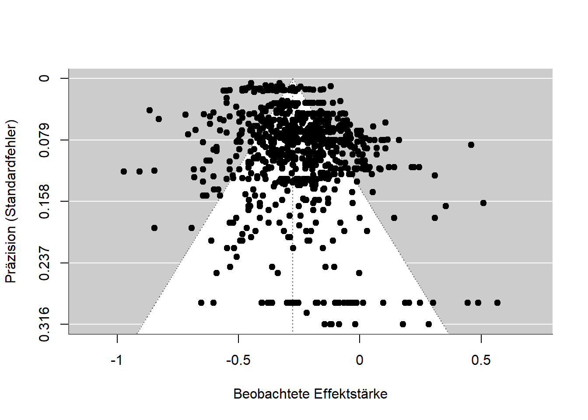
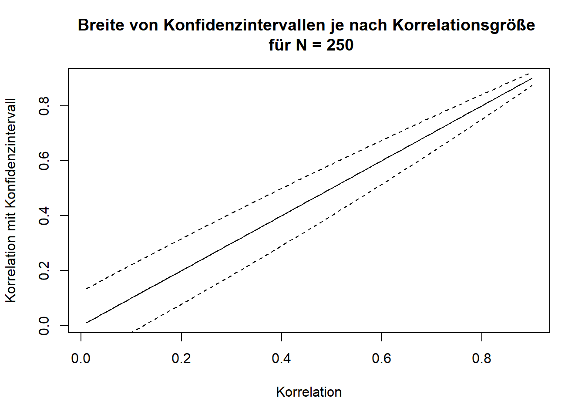
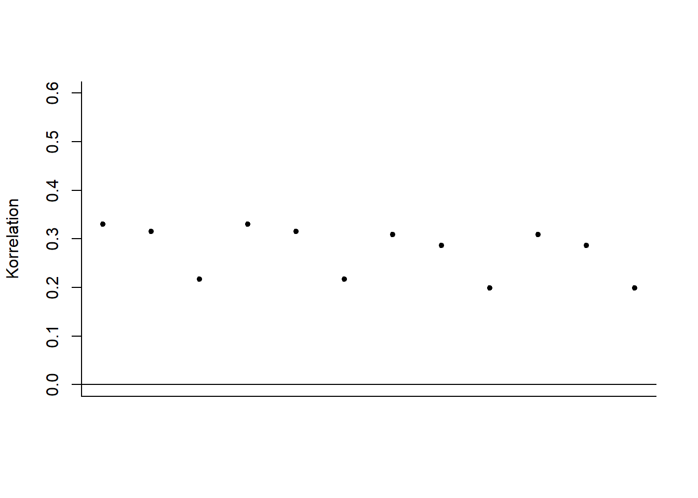
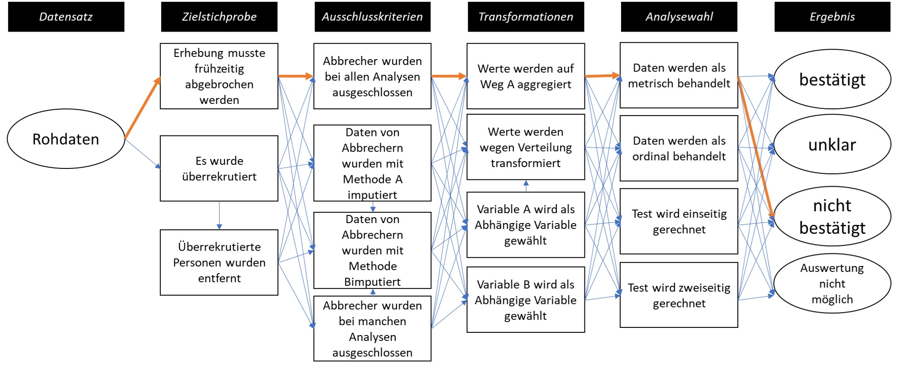

In science there is no *one method* [@Feyerabend.19752002]; rather, methods are developed for problems, problems are solved, and methods are refined or abandoned. Methods are thus like tools, and not everything can be assembled with a single screwdriver. Open science reforms bring countless methodological innovations, improvements, and proposals that researchers often find overwhelming: advancing research projects, teaching seminars and lectures, raising external funding, and now also open science? While many problems are attributed to inadequate methods training [@lakens2021practical], which researchers then have to make up for on their own time, some methods actually make the work easier. For doctoral students in biological psychology, for example, the guide ARIADNE was developed (<https://igor-biodgps.github.io/ARIADNE/graph/graph.html>). This chapter offers an overview of methodological developments and debates in the social sciences and in disciplines that primarily work with statistical methods.

### Meta-Analyses

Meta-analyses are studies of studies. Researchers typically extract results from already published studies, write to other researchers in a field to ask about unpublished studies, and use statistical methods to analyze the similarities and differences between the results. @fletcher2022replication argues that only meta-analyses can demonstrate the generalizability of (statistical) phenomena. In an ideal world, everyone could carry on as before and meta-analytic models would simply correct for the problems. Given the devastating extent of publication bias, however, this is currently not possible. How meta-analyses can nevertheless be informative is discussed in general terms by @carlsson2024beginner, and I list specific problems and solutions below.

### Assessing Publication Bias and P-Hacking

For meta-analyses, the rule is: garbage in, garbage out. Anyone who combines many poorly conducted studies in a meta-analysis ends up with a poor summary. This is, for instance, what happened when @Hagger.2010 found a substantial effect for a model of willpower in their meta-analysis, yet subsequent large-scale replication attempts and analyses all failed to find an effect of comparable size [@Hagger.2016b; @Friese.2018; @Dang.2020; @vohs2021multisite]. What can still be done — and should be done in every meta-analysis — is an assessment of data quality, for example the extent of publication bias. There are methods that check whether unpublished studies exist, and methods that correct for potentially missing studies. Some of these only work with more than 200 studies, while others can already be applied to a dozen studies.

### Funnel Plot

One of the oldest methods is the funnel plot [@light1984summing]. It plots the precision and effect size of individual studies in a single diagram. Ideally, the points should form the shape of a funnel: the more precise a study is (for example, due to a large sample), the closer the association it measures should lie to the true mean. Less precise studies deviate unsystematically, sometimes above and sometimes below. Because non-significant results are rarely published, funnel plots almost never actually show a funnel shape — instead, the non-significant results are simply missing.

The figure below shows a funnel plot for a study on the relationship between math anxiety and math performance. The pattern is nearly symmetrical, indicating only weak publication bias. The small associations at the bottom edge are skewed slightly to the right, and the precise effects at the top are not all the same size but vary considerably.

{#fig-funnelplot width="100%"}

### P-Curve

In p-hacking, data are analyzed in multiple ways and only the analysis yielding a low, and therefore significant, p-value is reported. Results thus become significant not because the hypotheses are correct, but because the data were analyzed until they became significant. In the chapter on p-hacking we saw how p-values are distributed depending on whether the hypothesis is correct or not. The p-curve [@Simonsohn.2014; @Simonsohn.2014b; @Simonsohn.2015b] makes use of exactly this fact. The p-values from a set of studies are plotted in a diagram and their distribution is examined. If there is no p-hacking, the values are either uniformly distributed (all p-values occur equally often) or cluster near 0 (smaller p-values occur more often). P-hacking, however, causes the values to cluster near the 5% threshold, since the data need not be "hacked" any further than that. The method gained particular prominence when @Simmons.2017 applied it to one of the most famous phenomena in psychology, power posing, and found that p-hacking had likely occurred there. Critics later pointed out other ways a suspicious p-curve can arise even without p-hacking, and the method is now rarely used [@Erdfelder.2019].

### Z-Curve

Instead of using p-values, meta-analytic findings can also be converted into so-called z-values. These are normally distributed, and additional algorithms can be used to estimate, based on observed effects, how many further effects there ought to be. This method, called the z-curve [@Bartos.2022b], can thus correct for the file-drawer effect and for p-hacking. Its output also includes an estimate of what the replication rate would be if all the analyzed studies were conducted again. According to recent studies, these estimates work quite well, although they require a large amount of data [@Sotola.2022; @Sotola.2023; @roseler2023predicting].

### Sensitivity Analysis

An approach that works not only for meta-analyses but for almost all statistical analyses is the so-called sensitivity or robustness analysis. Different analytical pathways are run through and the extent to which they affect the results is examined. In meta-analyses, for example, many possible procedures can be computed at once. Such a "shotgun" approach was coined by @Kepes.2017 and has since been adopted in other studies [@Korner.2022]. @Carter.2019 provide an overview of various procedures and the conditions under which they are suitable for particular data.

### Forensic Meta-Science

Various fields have developed methods for identifying implausible data patterns. Such techniques check, for instance, whether reported values are even *possible*: if 10 people each have a value of either 0 or 1, the mean of those 10 values cannot be 0.15, but only 0, 0.1, 0.2, 0.3, ... 1.0. A collection of guides for checking such problems is COSIG ([Collection of Open Science Integrity Guides](https://osf.io/2kdez/wiki/home/)) [@cosig_commentary].

### Rules of Thumb for Assessing Individual Articles

A meta-analysis is laborious and can take several years. Even researchers who lack the funds for student assistants to help code and check hundreds or thousands of studies have little chance of conducting a proper analysis on their own. The following rules of thumb — and they are not meant to be more than that — offer shortcuts for assessing scientific quality.

### Many Significant Studies

Since a crisis of confidence in social psychology in the 1960s [@Lakens.2023], many journals have required multiple studies per research article. As a result, resources have been invested in several smaller studies rather than one solid study. Most of these "multi-study papers" then report exclusively significant results across as many as 10 studies. While many studies with uniformly significant results may look impressive at first glance, closer inspection raises suspicion: individual studies typically have an 80-95% probability of yielding a significant result in the central analysis. This probability (statistical power) decreases when several studies are run in sequence. It is comparable to a marksman who hits a glass bottle with a rifle 99% of the time. The probability that he hits a single bottle with one shot is thus 99%. The probability that he hits 50 out of 50 bottles with 50 shots is lower, namely 99%^50 (to the power of fifty) = 60.5%. Scientific studies undergo a similar "power deflation." The probability of conducting 4 significant studies, each with 80% power, is 40.96%. Actually publishing exactly such a set of studies is then extremely unlikely [@Lakens.2017b].

### Effect Sizes "Just Barely Significant"

Following the logic of the p-curve, it is unlikely that p-values fall between 1% and 5%. Due to p-hacking, however, this happens frequently. A p-value close to 5% also comes with a confidence interval for the effect size that is close to 0, e.g., [@jane2024guide]. Suppose someone conducts two studies on a topic and both have p-values near 5% with roughly equal numbers of participants; the question then arises why the sample size was not increased for the later study — given a result that was only just significant, it is clear that the researcher was "lucky," since statistical power was not particularly high. When planning the sample for the next study, one should therefore build on the first study and adjust the plan accordingly, e.g., [@Lakens.2021].

{#fig-ci-breite width="100%"}

### Checking for Reproducibility

If a finding is tested again using the same data and, ideally, the same program or analysis code, to check whether the same numbers come out — not merely whether the hypothesis is confirmed again — this is called a reproduction of the results. Unlike a replication, no new data are collected. That results are reproducible ought to be the absolute minimum standard for scientific reports, yet it is far from being met. Reproduction studies are still rare. The average success rate across fields (economics, education, biomedicine, health sciences, geosciences) is around 50% [@cobey2023epidemiological; @C_Chang2022-hx; @Koukouraki2023-cy], and even the success rate for simple analyses using programs that explicitly output reproducibility protocols is extremely low [@thibault2024evaluation].

::: callout-important
## Terminological Confusion

While the term *replication* in economics refers both to testing an existing study with new data and to re-testing with the same data, psychology uses the term *reproduction* for the latter. In biological reproduction research, the term "reproducibility" is used instead to avoid ambiguity. In yet other cases, such as @OpenScienceCollaboration.2015, replications (new data) are referred to as "reproducibility," while repeated tests with the same data are called "computational reproducibility." Finally, in some areas the boundaries blur — for example, when a replication of the PISA study findings uses partly the same and partly new data, or when the data are computer-generated and the same program can use a pseudo-random number generator to produce different data with the same underlying structure.
:::

For a few years now, the journal Meta-Psychology has been one of the first in psychology to conduct reproducibility checks for all published articles. These are carried out by researchers voluntarily or as part of their work for the journal. While this practice has already been called for at other journals [@lindsay2023plea], it is still the exception. Reproduction checks from all sorts of disciplines can be published at Rescience (<http://rescience.github.io>). Independent of journals, the Codecheck community offers to check the code of any research article to verify that it runs and that the results can be recomputed [@Nust2021-zj]. Articles with verified code can then reference the CODECHECK report, which is uploaded as a public article on Zenodo.org.

For 2024, the Institute for Replication announced that it would reproduce studies from the journal Nature Human Behaviour [@noauthor_2024-ta]. Nature Human Behaviour is one of the most prestigious journals in research on human behavior — though prestige should not be equated with scientific quality. It is managed by the Springer publishing group and charges the highest article processing fee, around €9,000 per article. The strategic decision to focus on articles from that journal has the advantage that the people conducting the reproducibility checks may be able to publish them there, and that the reproductions receive considerable attention. Given the quality standards such journals claim for themselves, and the fact that free journals like Meta-Psychology can carry out the procedure without external help from the Institute for Replication, we again see the familiar pattern of publishers exploiting their prestige to extract free, profit-generating labor from the scientific community. In the end, it is once again not the journal itself that contributes to scientific quality assurance, but the Institute for Replication.

A shortcut for checking correctness, used by many journals, is the program [statcheck](statcheck.io). It automatically detects classic statistical tests and checks, based on the reported values, whether they are internally consistent. @hartgerink2016688 checked results from over 50,000 articles with the program and had the articles commented on via PubPeer. Because the algorithm — as openly acknowledged in the comments — occasionally flags values as erroneous incorrectly, and because the authors of the articles were not warned about the comments beforehand, the [DGPs (German Psychological Society) condemned the practice](https://www.dgps.de/schwerpunkte/stellungnahmen-und-empfehlungen/stellungnahmen/details/stellungnahme-des-dgps-vorstands-zur-praxis-der-automatischen-plausibilitaetsueberpruefung-wissenschaftlicher-arbeiten-mit-statcheck/). The responses from the Statcheck group and from Chris Hartgerink are no longer available.

::: callout-note
## Reproduction at the Push of a Button

*Push-button replications* refer to results that can be recomputed by any researcher with little effort — at the push of a button, as it were. While social science journals increasingly require that data and analysis code be published in a form that allows results to be recomputed, the journal Image Processing Online (IPOL, https://www.ipol.im) embodies the ideal of this approach: for every article published there, a demo is available in which, after selecting an image, the algorithm published in the article is run live.
:::

#### Large-Scale Reproduction Projects

Various research disciplines have launched large-scale projects to estimate reproducibility for entire disciplines. A pioneer in this field was Höffler's ReplicationWiki ([https://replication.uni-goettingen.de](https://replication.uni-goettingen.de/)). Subsequent projects such as the Replication Network (<https://replicationnetwork.com>) drew heavily on the data compiled there. For economics, @brodeur2024mass reported a reproducibility rate of 70%, and in management science 55% [@fivsar2024reproducibility]. The Institute for Replication (I4R) also overlaps with the Social Science Reproduction Platform of the Berkeley Initiative for Transparency in the Social Sciences (BITSS; <https://www.bitss.org/resources/social-science-reproduction-platform>). While I4R published a database of all results in 2024, the BITSS platform has already been available for some time. Alongside these predominantly economics- and political-science-oriented initiatives, the interdisciplinary Multi100 project investigates the robustness of 100 results from various fields ([https://osf.io/q5h2c](https://osf.io/q5h2c/)). A completed project originating in psychology was a university's offer to check researchers' work for reproducibility [@baker2023reproduceme]. In the geosciences, CODECHECK (<https://codecheck.org.uk>) offers a community in which researchers certify the one-time reproducibility of code. A journal that publishes reproducibility checks is Rescience C (<https://rescience.github.io>).

#### Open Code

Publicly available data and code are necessary for reproduction and robustness checks. Journals face a trade-off here between making submission harder — and thus making themselves less attractive — by imposing higher requirements, and promoting scientific quality assurance. A similar problem exists among the operators of panels in which large surveys or performance tests are regularly conducted, such as the PISA study or the Socio-Economic Panel (SOEP). In analyses of SOEP data, code is shared in only 20% of cases (<https://www.wifa.uni-leipzig.de/fileadmin/Fakultät_Wifa/Institut_für_Theoretische_Volkswirtschaftslehre/Professur_Makroökonomik/Economics_Research_Seminar/ERS-Paper_Marcus.pdf>).

### Robustness Analyses

Similar to sensitivity or robustness analyses in meta-analyses, individual studies can also explore further paths in the "garden of forking paths." As a reminder: the path from data to results is long and involves many different decisions. To show that the result does not actually depend on these decisions, one can demonstrate what the results look like if different decisions had been made. The most extreme form of such robustness analyses is the *multiverse analysis* [see, e.g., @mazeidon for recommendations]. Here, an attempt is made to make all possible decisions simultaneously. The resulting set of results is then analyzed or presented in some form (e.g., averaged) [@jacobsen2024preprocessing]. Another option is the *multi-analyst study*. This concerns the dependence of results on the decisions of different researchers, with many people analyzing the data independently of one another. In the end, it is checked how strongly the results agree across researchers.

The figure below shows the results of different analysis methods applied to a fixed dataset (fictional data). Different types of correlations, different sample sizes, and different hypotheses were used. The result changes slightly each time, so that the value ranges between 0.20 and 0.35, but the positive (and significant) correlation is preserved throughout.

{#fig-robustheit width="100%"}

#### Reproducible Manuscripts

In the online version of this book, it is possible to display the code behind a figure before the figure itself. With this code, the figure can easily be reconstructed or reproduced. Research articles, too, can be written in this way. Text, programming code, and results in the form of numbers, tables, and diagrams are all written within a single program, sparing researchers the need to copy or retype numbers. Recomputing results is also made much easier. These programming environments are based on the so-called Markdown language, and countless other programming languages can be embedded within such documents.

While researchers often lack the expertise or time to make their manuscripts reproducible, pilot projects already exist [@baker2023reproduceme], as do journals that support researchers in doing so [@Carlsson.2017]. In combination with multiverse analyses, it is also possible, for research articles published online, to write the text so that it reacts interactively to alternative analytical decisions. Readers can thus make decisions within the manuscript and directly see how the results change.

### Statistics

Probably every research discipline that uses statistics has been affected by the replication crisis. Very much in the spirit of "post hoc ergo propter hoc" (after this, therefore because of this), this fact is often interpreted to mean that the use of statistical methods is the cause of the replication problems. While counterarguments hold that the methods are simply being used *incorrectly* [@Lakens.2021b], some researchers also propose changes or alternatives. A group of 72 psychologists, for instance, called for lowering the significance threshold for new findings from 5% to 0.5% [@Benjamin.2018], making p-hacking harder. Others propose banning null hypothesis significance testing (NHST) altogether and using other methods instead: @Wagenmakers.2007 advocates for Bayesian statistics, and the journal Basic and Applied Social Psychology has banned the use of significance tests entirely — a move that may actually have increased the problem of false-positive findings [@fricker2019assessing].

### Open Data and Open Materials

Because of frequent fixed-term contracts and repeated moves between universities, but also because of discontinued doctorates or people leaving academia due to the Wissenschaftszeitvertragsgesetz (Germany's fixed-term academic contract law), projects must often be handed over to other researchers. If the research materials and data are not documented and prepared properly, time and effort are lost in the process. In extreme cases, animals were raised and operated on in a laboratory, and the investigation cannot be continued. Open data and materials are meant to prevent this, to enable collaborative work, and to make errors correctable. In more extreme cases, researchers attempt to publish articles based on fabricated data. Only where openly accessible data exist can such fraud be detected [@carlisle2021false].

Numerous studies have already shown that data are frequently not shared even upon request, and that this has not changed in the wake of the replication crisis [@vanpaemel2015we]. Moreover, whether data are shared says nothing about whether they contain errors [@claesen2023data]. More and more journals require the publication of data (e.g., https://topfactor.org/journals?factor=Data+Transparency), funding bodies require data management plans, tools for automated data preparation are under development (https://leibniz-psychology.org/das-institut/drittmittelprojekte/datawiz-ii), and numerous research data repositories — websites where data can be uploaded and found — have emerged.

The most important prerequisites for researchers to be able to share data are the consent of participants (where applicable), anonymization where necessary (e.g., for data on health or political views), and holding the rights to the data. Participant consent is routinely obtained before a study begins; anonymization takes place either during data collection or afterward (e.g., for qualitative data using [AMNESIA](https://amnesia.openaire.eu)); and the rights are usually only lacking when the data were collected on behalf of a company. The most difficult part is probably anonymization. @campbell2023open, for example, report how they anonymized accounts from survivors of sexual assault using a multi-stage process in which names, dates, locations, trauma histories, and other sensitive information were redacted.

::: callout-note
## Where Are Research Data Uploaded?

Depending on the field and institution, research data are archived in different places. Universities often have their own services, but field-specific repositories are usually better for discoverability: psychologists frequently use the [Open Science Framework (OSF)](https://osf.io/), [PsychArchives](https://www.psycharchives.org) from the Leibniz Institute for Psychology, or [Researchbox.org](researchbox.org). For economics, the Leibniz Institute for the Social Sciences offers various resources via [GESIS](https://www.gesis.org/datenservices/daten-teilen). In chemistry, [LISTER](https://www.nfdi4chem.de/de/lister-halbautomatische-metadatenextraktion-aus-kommentierter-experimentdokumentation-in-elabftw/) is software under development that semi-automatically describes data based on electronic lab notebooks. [Re3data](https://www.re3data.org) provides an overview of research data repositories (e.g., by field).

| **Field** | **Repository** |
|------------------------------------------|-------------------|
| Interdisciplinary, mainly psychology | osf.io |
| Social sciences | data.gesis.org |
| Political science and social sciences | icpsr.umich.edu |
| Life sciences | Pangaea.de |
| Arts and humanities | de.Dariah.eu |
| Linguistics | Clarin.eu |
| Biology | gfbio.org |
| Materials science | nomad-lab.eu |
| Qualitative data | qdr.syr.edu |
| Interdisciplinary | openbis.ch |
| Interdisciplinary | about.coscine.de |
| Interdisciplinary | frdr-dfdr.ca/repo |

: Repositories for research data.
:::

::: callout-warning
## Where Are Research Data Published?

Repositories allow research data to be published with a mouse click. If additional features such as interactive analyses or peer review are desired, researchers use dedicated tools and specialized journals. Psychological datasets, for example, can be published in the Journal of Open Psychology Data, the R package PsyMetaData [@rodriguez2022psymetadata] contains data from psychological meta-analyses, and the journal [Inggrid](https://www.inggrid.org) publishes data from engineering research.

On dedicated websites, researchers can access chat log data voluntarily shared and anonymized by individuals at [MOCODA](https://db.mocoda2.de), download data on human cooperation at [CODA](https://cooperationdatabank.org), or analyze estimation judgments at [OpAQ](https://metaanalyses.shinyapps.io/OpAQ/).
:::

#### Criteria for Preparing Research Data

Merely uploading research data to a website is not enough to make research more transparent. Typically, the data are linked in the research article in which they were used, and a codebook is provided that explains what the various values mean.

The table below shows an excerpt from a fictional dataset with three variables. Real datasets usually contain many more variables (e.g., high school GPA broken down by subject, demographic data such as age and gender, date of the survey, and sometimes variables with cryptic names like "V1_Z01" or "V0815"). Here, the three variables (i.e., columns) are "ID," a sequential number identifying each participant; "IQ," the measured IQ score from a particular intelligence test; and "high school GPA," which participants reported themselves. The codebook contains this information.

::: {.content-visible unless-format="pdf"}
| **ID** | **IQ** | **High school GPA** |
|-----|-----|------------|
| 1 | 103 | 2.6 |
| 2 | 86 | 2.4 |
| 3 | 112 | 1.8 |

: Example of a dataset.
:::

::: {.content-visible when-format="pdf"}
```{=latex}
\begin{table}[H]
\centering
\begin{tabular}{@{}lll@{}}
\toprule
\textbf{ID} & \textbf{IQ} & \textbf{High school GPA} \\
\midrule
1 & 103 & 2.6 \\
2 & 86 & 2.4 \\
3 & 112 & 1.8 \\
\bottomrule
\end{tabular}
\caption{Example of a dataset.}
\end{table}
```
:::

#### FAIR and CARE

The FAIR principles for research data were developed on an interdisciplinary basis. They recommend that data be archived so as to be findable (**F**), accessible (**A**), interoperable (**I**) across different computer systems, and reusable (**R**). @de2016research structures these requirements as a pyramid, with storage as the foundation, sharing above that, and quality assurance at the top. According to an [EU report](https://publications.europa.eu/resource/cellar/d375368c-1a0a-11e9-8d04-01aa75ed71a1.0001.01/DOC_1), the annual cost of data not complying with the FAIR principles amounts to €10.2 billion. Discipline-specific templates for making shared data FAIR are currently being developed by the Center for Open Science (www.cos.io/blog/cedar-embeddable-editor).

The CARE principles go a step further. They were designed for data collection involving Indigenous peoples. Building on FAIR, they call for collective benefit (**C**) of the data — for example, usability by society, as is the case with [flood hazard maps](https://www.flussgebiete.nrw.de/hochwassergefahrenkarten-und-hochwasserrisikokarten), or through citizen participation, as with Münster's "[Cool City Map](https://beteiligung.nrw.de/portal/muenster/beteiligung/themen/1004355/1007106/1048392)," which lets residents mark places that stay cool on hot days. The people represented in the data must be given authority to control (**A**) how the data are used — that is, they should have a say in how the data appear. To preserve their self-determination, data should also be shared responsibly (**R**), and their rights and well-being should be central to the research (**E**thics). When non-scientists actively participate in data collection or preparation, this is referred to as citizen science. For example, people can send their collected love letters to the [Liebesbriefarchiv](https://liebesbriefarchiv.de) (Love Letter Archive), which allows the German language, social conventions, and cultural change to be studied more comprehensively than would be possible using only a handful of famous scholars, or people can operate space telescopes over the internet from their own home computer (<http://www.aim-muenster.de>). This does not mean that laypeople conduct research on the basis of which they overturn "classic" research findings [@Levy2022-zs], but rather that they gain insight into the research process and can contribute to knowledge generation under guidance.

::: callout-note
## Requesting Research Data from Governments

When governments commission companies to answer research questions, citizens can request the underlying data. In the United Kingdom, for example, there is the platform [WhatDoTheyKnow](https://www.whatdotheyknow.com/request/trial_protocols_behavioural_insi_2); in Germany, the equivalent is [FragDenStaat](https://fragdenstaat.de). In one study, @maier2024exploring used such data to check whether recommendations regarding open science practices had been taken into account.
:::

### Concerns About Open Data

#### Data Police

The discourse around open science is at times highly charged: researchers who ask for data, or use data to identify errors, are labeled data parasites, data police, or even data terrorists. The claim that "those who have nothing to hide have nothing to fear" has a dystopian undertone, and in politically charged times, and in the face of plagiarism hunters, researchers are understandably reluctant to make themselves fully transparent. In this context, however, it should be kept in mind that science is not a solitary hobby but a profession with social responsibility. Anyone hiding something here should rightly be suspected of not doing proper science. Fittingly, the outside wall of the University and State Library in Münster bears large red letters reading: "Obey no one." Form your own opinion instead — go to the researchers' work and data and see the truth for yourself. When researchers do not share their data and publish articles behind paywalls, this constitutes an unnecessary obstacle to independent opinion-forming.

#### Data Theft

Sharing data often conflicts with the goal of maintaining a competitive advantage over other researchers. This means that researchers withhold their data, publish as many articles as possible based on it, and only share the data once there is "nothing left to extract" from it. The concern is that other researchers might be quicker to publish articles based on the data. In practice, however, the data end up not being published at all. It is important to understand, regarding this concern, that *sharing* data does not mean *giving away* data. When sharing, researchers can attach a license that, for example, specifies how the data must be cited. If other researchers fail to comply, they risk their careers. Furthermore, it is easier to prove who originally collected the data if that person published it early on.

#### Citation Counts

Open data is sometimes promoted with the argument that it leads to more citations. This motivates some scientists more than good scientific practice does, but is probably not actually true [@colavizza2020citation].

::: callout-note
## What Does Long-Term Archiving Mean?

Funding bodies sometimes require long-term archiving. Depending on the context, this means that data must be stored and retrievable for 20 or 50 years. A somewhat extreme variant of long-term archiving was carried out with data from Github.io: all data that had been uploaded there as of February 2, 2020 were saved and transported to a disused coal mine in Norway. There they are meant to remain retrievable for up to 1,000 years.
:::

### Increasing Replicability

The approaches discussed so far, such as meta-analyses or reproducibility checks, can often be applied to existing projects. The following proposals, however, are more difficult to apply retroactively — they are mainly suited to new research and aim to increase the replicability of newly published studies. This includes stricter methodological standards or replications carried out before publication ("internal replications"), as is standard practice, for instance, in genetic epidemiology. A positive side effect here is that research groups join forces for replication studies and exchange data [@royal2018replication]. As discussed in the book's conclusion, it is difficult to make a general, cross-disciplinary statement about whether these proposals actually affect replicability, given how rare replication studies still are. Even in social psychology, replications are currently still the least-implemented measure among all open science recommendations [@glockner2024quality]. Either way, the value of measures that generally increase the transparency of research is clear with respect to replication difficulties and p-hacking.

::: callout-note
## Transparent Reports

@Aczel.2020 designed a *Transparency Checklist* that researchers can work through point by point to check whether their research report is transparent. In the online app (https://www.shinyapps.org/apps/TransparencyChecklist/), a report can then be generated and attached to the research article. The checklist is divided into the topics of preregistration, methods, results, and data/code/materials. Regarding results, for example, it asks whether the number of observations was reported for all groups. The checklist is currently available in about 30 languages, including German. The checklist by @Aczel.2020 is, however, primarily suited to quantitative studies. For qualitative and mixed-methods studies, @symonds2024quality have developed an assessment scheme.

A further and shorter variant is the 21-word solution. Here, a proposed statement [@Simmons.2012] is included in the report, assuring readers that no studies (or results) were withheld. It is far less rigorous and comprehensive than the transparency checklist, but it lowers the barrier to engaging with the transparency of research reports.

For animal studies, the ARRIVE guidelines were developed. Building on these, the LAG-R standards aim to ensure clear reporting of the genetic make-up of the animals studied [@teboul2024improving].
:::

#### Preregistration {#sec-preregistration}

Research is either confirmatory (i.e., researchers have thought through in advance which data they will collect, which analyses they will run, and what the possible results might be) or exploratory (i.e., researchers try to approach a topic without preconceptions, generating questions for future, possibly confirmatory, research). Whenever research is confirmatory, it should be *preregistered*. This means that all the thinking researchers should have done in advance should be written down before data collection begins. Preregistrations are meant to prevent researchers from ending up in a *garden of forking paths* — or rather, they help fix the path in advance, so that it is no longer possible afterward to change the path in order to produce the desired results.

{#fig-forkingpaths-prereg width="100%"}

A good preregistration is characterized by researchers stripping themselves of all degrees of freedom [@Wicherts.2016] and specifying in advance all the decisions they will make on the way from data to results. Preregistrations should also be well structured, so that other people can easily verify what was determined beforehand [@Simmons.2020b]. To record all necessary decisions (e.g., how to handle missing values or the planned number of participants) in a structured way, preregistration templates exist. These exist for all kinds of areas, such as social-psychological experiments [@vantVeer.2016] or replication studies [@Brandt.2014]. A collection of more than 20 templates along with their intended uses is available [here](https://osf.io/7xrn9). Researchers with little experience in a given area are supported by such templates. For instance, preregistration templates for meta-analyses include overviews of literature databases and already incorporate gold standards for transparent reporting [PRISMA, @DavidMoher2015]. Moreover, the preregistration materials can later be reused for the manuscript itself.

The method of preregistration developed within psychology, drawing on the *registration* of studies involving human participants in medicine and the registration of meta-analyses. Like some other models, it transfers to many other fields without major adaptation — for example, to paleontology [@Drage2023-fx].

#### Preregistration Should Always Include an Analysis Plan and Analysis Code

Regarding the spread of preregistration, there is an ongoing debate about whether it should be introduced in as simple and resource-efficient a form as possible, or whether extensive and carefully prepared preregistrations should be required. For instance, the [widely used](https://datacolada.org/115) template from aspredicted.org consists of only 11 questions and does not allow analysis code or other files to be attached. Since the purpose of preregistration is to prevent p-hacking, compromises on the scope of preregistrations make little sense.

Analysis code is based on a particular program and corresponding programming language and carries out the preparation of the data (e.g., computing scores, excluding observations) as well as the analyses themselves. Traditionally, it is written after the data have been collected. This can render studies worthless, because it may only become apparent after data collection that the planned analyses are not feasible, and because studies may then be analyzed in whatever way produces the desired results (p-hacking). @van2023preregistration were unable to demonstrate, for psychology research articles, that preregistration protects against p-hacking, but they did not distinguish between preregistrations with and without an analysis plan. For Registered Reports, which typically require a fully worked-out analysis plan, @scheel2021excess were able to show that the proportion of hypothesis-confirming results drops sharply. Using thousands of statistical tests from economics research articles, @brodeur2024preregistration showed that preregistration only protects against p-hacking when an analysis plan is present. An analysis *plan* differs from analysis *code* in that the latter is unambiguous. A plan might state, for example, "we will compute the correlation between variable X and variable Y and test whether it is significant." This does not specify which significance level will be used, whether a one-tailed or two-tailed test will be performed, which type of correlation will be computed (Pearson, Spearman, Kendall), how missing values will be handled, and so on. The probability of obtaining a significant result when the true correlation is 0 then rises from the nominal significance level of, say, 5% to 10%. This cannot happen with programming code (e.g., "cor.test(x, y)"), since the default settings used when something is left unspecified are clearly defined there. Reviewers of research should therefore pay close attention to exactly what is included in a preregistration [@thibault2023reflections].

#### Deviations from Preregistrations

"The more deliberately people proceed, the more effectively chance strikes them," as Friedrich Dürrenmatt puts it in his 21 points on "The Physicists" [@durrenmatt2012physiker]. The same holds for preregistrations: researchers cannot anticipate every eventuality. It must therefore be expected that, due to programming errors, reasoning errors, or previously unconsidered arguments, researchers will need to proceed differently than specified in the preregistration. Deviations from preregistrations are very common [@Heirene.2021] — for instance, the actual sample size differs from the target sample size in [more than 50% of cases](https://osf.io/f2z7y). Once again, transparency is what distinguishes the right way to handle this: every deviation should be clearly communicated, and it should be discussed why the deviation occurred and how it affects the results (e.g., by checking whether results change when the target sample rather than the full, larger-than-planned sample is used) [@Heirene.2021; see also @lakens2024and]. Currently, reviewers do not check preregistrations or deviations from them [@syed2023some; @targ2021estimating]. Tools that do this automatically are, however, under development (e.g., RegCheck, <https://regcheck.app>).

#### Where Are Studies Preregistered?

A broad infrastructure already exists for preregistering studies. Researchers can, for example, preregister studies via the Open Science Framework (osf.io) and also upload data, materials, analyses, and manuscripts there, as well as later publish preprints. Projects and preregistrations can also remain private or anonymized, and preregistrations can be placed under a multi-year embargo — a period during which the preregistration is not yet public and can only be accessed via a special link. All public preregistrations are automatically indexed by Google Scholar and are thereafter findable, citable, and also visible in the [OSF search engine](https://osf.io/registries). Within OSF, either open templates or specific existing templates, such as the one by @Brandt.2014, can be used for preregistration ([further templates](https://www.cos.io/blog/call-for-submission-for-preregistration-templates) will be incorporated in the future).

Another preregistration provider is aspredicted.org, though no files can be attached there, and its 11 questions are primarily suited to classic psychological studies. Medical studies are registered — usually without the details that are important for genuine preregistration — via <https://clinicaltrials.gov>, and meta-analyses via PROSPERO (<http://www.crd.york.ac.uk/PROSPERO/>).

::: callout-note
## Preregistration Checklist

**Before conducting the study**

- The methodology and analysis plan of the study have been described completely and in a structured way (ideally using a template)

- The analysis script has been written and tested using test data or random numbers, and it works

- The preregistration has been time-stamped and archived before the study (e.g., via OSF.io)

**After conducting the study**

- A link to the preregistration is included in the manuscript (e.g., in the methods section or in a paragraph on the transparency and openness of the study, ideally paired with links to data and materials)

- All deviations from the preregistration are listed and justified
:::

#### What If the Desired Results Do Not Come Out?

A question researchers often ask me when discussing preregistration once again demonstrates the discrepancy between *research that is good for science* and *research that is good for one's career*. A preregistration prevents results from being dressed up (p-hacking). This increases the risk of obtaining results that are hard to publish, for example because they are not groundbreaking or not as expected. While a preregistration thus distinguishes researchers who are genuinely interested in good science, it can currently — in various research disciplines — have negative career consequences for not embellishing one's data.

#### Planning Sample Size

Another method, recommended mainly for confirmatory research using statistical methods, is planning the sample size. This planning can be based on available resources or other constraints, but in the social sciences and medicine it is often done via power analyses. Statistical power is the probability of detecting an association of a given size if such an association actually exists. The underlying logic is that an association should *not* go undetected simply because the study was not adequately designed to detect it.

Power analyses have been known for a long time, and it is regularly criticized, at least within psychology, that they are conducted too rarely [@Cohen.1988; @Cohen.1992; @Cohen.2013]. While they are still often absent or insufficiently integrated into students' methods training, there are now extensive guides [@Lakens.2021], software tools [@Zhang.2022; @Champely.2020; @Faul.2007; @Faul.2009], and [video tutorials](https://www.youtube.com/watch?v=XhfkodpyIsw). Methods have meanwhile also been developed for alternative significance tests [equivalence tests; @Lakens.2017; @Lakens.2018] and for replications [@Simonsohn.2015]. A particular type of sample planning is based on Bayesian statistics and is recommended especially in ethically sensitive situations such as animal behavior research: @richter2024challenging proposes computing the so-called Bayes factor — which, unlike p-values from significance tests, also converges when there is no true association — after every observation or trial, and concluding the study once a certain value has been exceeded. It is important to note that this approach is explicitly suited only to Bayesian analyses.

#### Effect Sizes Instead of P-Values

It is now clear that statistical methods are frequently misunderstood and misused [@perezgonzalez2014reconceptualization; @lakens2021practical; @gigerenzer2004mindless]. The discussion is currently shifting from p-values [@uygun2023epistemic] toward effect sizes and the question of what role different values play. For example, @vohs2021multisite were able to demonstrate that the controversial effect of diminishing self-control in the *ego depletion paradigm* does exist (i.e., it is not equal to 0) — but in their study it was so small that a successful demonstration alone would require over 6,700 participants, more than any experiment ever conducted on the topic, and almost twice the 3,524 participants used by @vohs2021multisite. It remains controversial whether researchers should focus on easily demonstrable phenomena, so-called "low-hanging fruit" [@Baumeister.2020], whether there is a threshold below which phenomena are practically undetectable and thus of no interest [@primbs2023small], and what practical relevance such small effects have [@anvari2021evaluating].

### Qualitative Research

In qualitative research, there is often no clear research question fixed in advance; instead, it is developed over the course of the research process. Alongside anonymization [@campbell2023open], preregistration therefore also plays a special role. Nevertheless, there are typical procedures — for example, decisions about how to code responses — that can be preregistered using dedicated [templates](https://docs.google.com/document/d/16vLoRAs6RmXKy0v1RCx6osSaYk4r64Hgl6S4_KtWbeM/edit#heading=h.fwbi14d4b65g).

### Open Source Software

Research without programs for literature search, reference management, data analysis, and academic writing is unthinkable in most disciplines. Even the systems used by academic journals to structure the submission process (submission, review, revision, publication) are based on software. This relevant area within software is called "research software engineering," and the challenge is that researchers, despite having had little prior contact with writing software (e.g., analysis code), must acquire expertise in this area. This ranges from general recommendations on the "idioms" of programming languages (e.g., the [Zen of Python](https://en.wikipedia.org/wiki/Zen_of_Python)) all the way to collaborative work using systems like GitHub or GitLab.

Open source means that a program's source code is readable and can be freely reused. This makes it possible to trace exactly what the program does. While, for example, the statistical software IBM SPSS has no such visible code, in GNU R every step of a statistical calculation can be traced. Errors that can jeopardize entire branches of science [@soergel2014rampant] are easier to detect in open source programs. In cryptography there is talk of [Kerckhoffs's principle](https://en.wikipedia.org/wiki/Kerckhoffs%27s_principle), which states that even encryption methods are more secure when only the key — not the encryption method itself — is kept secret. For example, software for analyzing fMRI data (a type of "brain scan") was not properly validated until 15 years after its introduction, and its quality turned out to be inadequate [@eklund2016cluster]. Furthermore, proprietary software — software "owned" by a company or an individual — carries the risk of *lock-in*: people come to rely on the program and align their workflows closely with it. At some point they become dependent on it, for example being able to manage their data only with that one program, or facing enormous costs if they were to switch [@Brembs.2023]. A license that identifies software as open source is the [GNU license](https://en.wikipedia.org/wiki/GNU_Free_Documentation_License). Widely used proprietary software outside of research includes Microsoft Windows and the Office suite, Adobe Acrobat for reading PDF files, or Zoom for video calls. While the German government of the 2021-2025 legislative period set itself the goal of putting software projects out to tender as open source projects, it [failed to follow through on this](https://www.zdf.de/nachrichten/politik/digitalisierung-verwaltung-open-source-software-fdp-ampel-100.html).

In short: for research in which traceability plays a primary role, open source software should be used wherever possible. For some methods this is currently not possible; there, it is the task of university libraries, as custodians of knowledge [@Quan2021-tp], and of professional societies, as the disciplines' points of contact, to provide or commission the necessary infrastructure.

::: callout-note
## A "Copy" of the Open Science Framework

One of the most valuable tools in the social sciences is the Open Science Framework (osf.io). It gives researchers the ability to preregister studies and publish data, research reports, and materials. The entire codebase is [available online](https://github.com/centerforopenscience) and was copied for another project ([GakuNin RDM](https://rcos.nii.ac.jp/en/service/rdm/)) and adapted to its needs. Licensing terms clearly permit the code to be copied and reused. This openness of knowledge makes it possible to create similar offerings without having to start from scratch.
:::

| **Infrastructure** | **Commercial Software** | **Non-Commercial Software** |
|------------------------|------------------------|------------------------|
| Literature database | SCOPUS | OpenAlex [@priem2022openalex] |
| Reference management | Citavi, Mendeley | Zotero [@puckett2011zotero] |
| Data collection | Unipark, Millisecond Inquisit | PsychoPy [@peirce2022building] |
| Statistical data analysis | IBM SPSS, Stata | GNU R [@RCoreTeam.2018], PSPP [@yagnik2014pspp], JASP [@love2019jasp] |
| Review and publication | Editorial Manager | Open Journal System [@willinsky2005open] |

: Commercial and non-commercial software.

### Slow Science

Many open science developments can be summarized under the heading of "slow science." The traditional mass production of low-quality research articles stands in contrast to a more mindful engagement and thorough scrutiny. @hyman2024freeing, for example, criticizes the fact that many of the proposed solutions put researchers at a disadvantage in the competition to publish. He proposes instead to solve these problems using artificial intelligence. Publishers such as Elsevier are already using AI [for peer review](https://www.elsevier.com/about/policies-and-standards/the-use-of-generative-ai-and-ai-assisted-technologies-in-the-review-process), even though models like ChatGPT 4.0 are not actually suited to this task [@thelwall2024can].

### Big Team Science

Large-scale research projects such as ManyBabies [@byers2020building], replication projects [@OpenScienceCollaboration.2015], initiatives like FORRT [@Azevedo2019-df], and software development efforts such as GNU R [@RCoreTeam.2018] have shown what large groups of researchers are capable of, and that many current problems cannot be solved by individual researchers alone. In physics, the record for the largest number of authors on a single study is held by a paper from CERN on the Higgs boson. About 15 of the 33 pages consist solely of the names of the people involved, with additional pages for their institutions [@aad2015combined]. In this context, the concept of "authors" is shifting toward that of "contributors" [@holcombe2019farewell].

To clearly state who did what, researchers can use the Contributor Roles Taxonomy [CRediT, @holcombe2019contributorship], which consists of standardized role descriptions. Apps can then be used to generate simple tables or lists showing the contributions of everyone involved [@holcombe2020documenting].

### Further Reading

- @kepes2023assessing have developed a beginner's guide for assessing publication bias.

- For preclinical studies, CAMARADES Berlin maintains a wiki on systematic reviews: <https://www.camarades.de>.

- @harrer2021doing have written a freely available book on conducting meta-analyses: <https://bookdown.org/MathiasHarrer/Doing_Meta_Analysis_in_R/>.

- @Adler.2023 have compiled various tools for the heuristic assessment of the trustworthiness of scientific findings. At <https://mktg.shinyapps.io/Toolbox_App/>, researchers can enter data and run the various procedures.

- @wilson2017good compile recommendations that all researchers should follow to ensure reproducibility.

- @giehl2024sharing discuss the technical hurdles involved in sharing human neuroimaging data.

- The recommendations of the German Psychological Society (DGPs) on handling research data [@schonbrodt2017umgang] are available online: <https://www.uni-muenster.de/imperia/md/content/fb7/ethikkommission/dgps_datenmanagement_deu_9.11.16.pdf>.

- <https://www.datalad.org> is a free program that automatically documents how knowledge is derived from data.

- Typical myths about open data are discussed in a blog post by Elina Takola: <https://www.sortee.org/blog/2024/04/12/2024_open_data_myths/>.

- With the FAIR-Aware quiz (<https://fairaware.dans.knaw.nl>), researchers can test their knowledge about sharing research data.

- Open educational materials on FAIR data are provided by [Jürgen Schneider](https://j-5chneider.github.io/PTOS-open-data/) and by the [University Library of Mannheim](https://github.com/UB-Mannheim/awesome-RDM).

- Examples of citizen science and ways to get involved can be found at [mitforschen.org](www.mitforschen.org/) and [Wissenschaft-im-Dialog.de](https://wissenschaft-im-dialog.de/mitmachen/).

- An overview and translations of the Contributor Roles Taxonomy are available online: <https://github.com/contributorshipcollaboration/credit-translation>.

- A guide to open source software is provided by Bitkom e.V.: <https://www.bitkom.org/Bitkom/Publikationen/Open-Source-Leitfaden-Praxisempfehlungen-fuer-Open-Source-Software>.

- On the YouTube channel "Veritasium," open source software is discussed in the context of a security vulnerability: <https://www.youtube.com/watch?v=aoag03mSuXQ>.

    ------------------------------------------------------------------------
