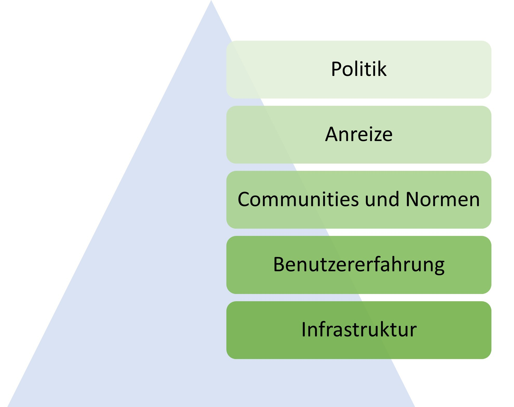
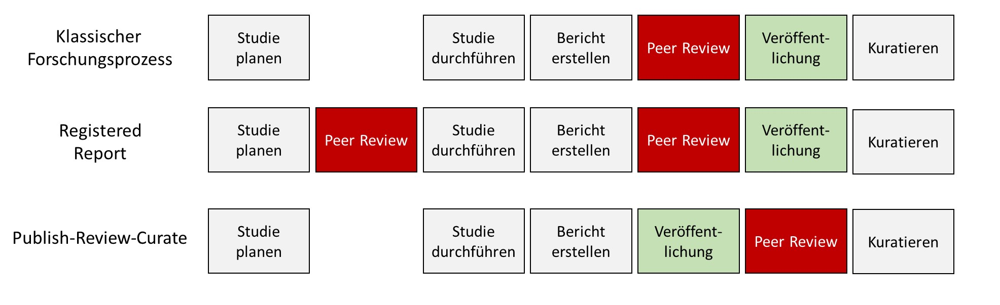

Approaches that aim to change the system hold the greatest potential, because in order to earn a living within the system, researchers have to play by its rules. And as long as publications are the currency, and papers with catchy titles and clear-cut results are judged to be of higher quality, researchers are motivated to search for catchy titles and clear-cut results rather than for the truth.

Overall, a positive development is visible [@Korbmacher.2023], and a shift in the incentive structure is being pursued. This shift can be understood as an alignment of the scientific system with the *Mertonian norms* (named after Robert Merton) [@merton1973sociology]: (1) Communalism: scientific knowledge should belong equally to all researchers, in order to foster collaboration. (2) Universalism: scientific merit is independent of the socio-political status and personal attributes of those involved. (3) Disinterestedness: scientific institutions act in the interest of science and not for personal gain. (4) Organized skepticism: scientific claims should be subjected to critical scrutiny before they are accepted.

In a [blog post](https://www.cos.io/blog/strategy-for-culture-change), Nosek recommends a framework of measures by which the desired changes should be made, one after another ...

1. possible (e.g., through infrastructure such as online repositories where research materials can be uploaded publicly and free of charge),
2. easy (e.g., through low-barrier offerings, multilingual instructions),
3. normative (e.g., through scientific communities that jointly stand behind calls for improvement),
4. rewarded (e.g., through designated awards), and
5. required (e.g., through minimum standards demanded by journals or funders)

... in that order. How the various approaches look in practice for the different actors — politics, universities, or journals — is discussed below.

{width="100%"}

### Politics

Internationally, political parties and associations clearly stand behind open science and open access. For example, UNESCO recommends universal access to scientific knowledge regardless of country of origin, gender role, political borders, ethnicity, or economic or technological barriers [@unesco2020first, p. 3]. [Working groups](https://opusproject.eu/openscience-news/open-science-horizon-unescos-recommendation/) for policy instruments, funding, and infrastructure have been established accordingly. The [G7](G7%20BEST%20PRACTICES%20FOR%20SECURE%20&%20OPEN%20RESEARCH%20Security%20and%20Integrity%20of%20the%20Global%20Research%20Ecosystem%20(SIGRE)%20Working%20Group) advocates for scientific integrity, academic freedom, and open science. [Open access](https://www.consilium.europa.eu/en/press/press-releases/2023/05/23/council-calls-for-transparent-equitable-and-open-access-to-scholarly-publications/) as well as [transparency](Triggers%20for%20audits%20of%20good%20laboratory%20practice%20(GLP)%20studies) of scientific procedures are likewise called for by the European Union. Infrastructure (e.g., the [European Open Science Cloud](https://eosc-portal.eu)) and various open science research projects are being funded specifically. In addition, the free publication and peer-review platform [Open Research Europe](https://open-research-europe.ec.europa.eu) is available for all research projects funded by the EU.

In Germany, the government of the 2021–2025 term had set out, in its coalition agreement, to "establish open access ... as a common standard" (my translation from the German). Individual federal states such as North Rhine-Westphalia have, through alliances of their respective universities, developed open *access* strategies [@Openness2023-fy] and are currently working on open *science* strategies. Other countries, such as Sweden, have already developed [national guidelines on open science](https://www.kb.se/samverkan-och-utveckling/nytt-fran-kb/nyheter-samverkan-och-utveckling/2024-01-15-national-guidelines-for-promoting-open-science-in-sweden.html). Regarding the problem of abuse of power, the issue is acknowledged, for example, in a position paper by the state of North Rhine-Westphalia, but it is understood as an [isolated case](https://opal.landtag.nrw.de/portal/WWW/dokumentenarchiv/Dokument/MMV18-2422.pdf) rather than a systemic problem ([commentary on this](https://www.jmwiarda.de/https-www.jmwiarda.de-2024-05-28-bitte-nachschaerfen/)).

### Universities

::: callout-note
## Which universities are doing something? (Examples)

The topic of open science has already found resonance at many universities. While most German universities have (time-limited) funds for open access publications, some have gone further and established open science policies (e.g., [FAU Erlangen](https://oa-info.sh/2022/01/open-science-policy-der-uni-erlangen-nuernberg/)), open science centers (e.g., [LMU Open Science Center](https://www.osc.uni-muenchen.de/index.html); [Cologne Open Science Center](https://oscc.uni-koeln.de/home); [Münster Center for Open Science](https://www.uni-muenster.de/MueCOS/); [Mannheim Open Science Office](https://www.uni-mannheim.de/open-science/open-science-office/)). In addition, the Leibniz Information Centre for Economics in Kiel and the Leibniz Institute for Psychology support replication research, for example with a replication journal (<https://www.jcr-econ.org>) or through a *Juniorprofessur* (a fixed-term professorship, roughly comparable to a tenure-track assistant professorship) in psychological metascience. At TU Dortmund, a needs assessment on research data management was conducted [@kletke2024bestands]. One of the largest centers for metascience in Europe has formed in Tilburg, the Netherlands. Germany's 15 largest universities (U15) have come out in favor of transparent and fair evaluation of research performance and have [signed CoARA](https://www.german-u15.de/en/Internationales/Archiv-Internationales-EN/Internationales-News-2024-EN/2024-06-04_CoARA_EN.html), and an alliance of many large scientific societies and communities (e.g., the DFG and the Fraunhofer Society, Germany's largest applied-research organisation) has likewise spoken out in favor of [traceable research assessment](https://zenodo.org/records/15836010). The Berlin universities have developed a joint open access declaration, the [Berlin Declaration](https://openaccess.mpg.de/Berlin-Declaration), and in France the University of Sorbonne is a pioneer: together with the University of Amsterdam and University College London, it signed a declaration on the publication of research data. Since 2024, the University of Sorbonne has also terminated its contract with Clarivate for the use of the "Web of Science" research database and has since been working with the open source software "OpenAlex" [@Priem2022-mb].

Using the Road2Openness tool (<https://road2openness.de/tool/>), institutions can conduct a self-assessment across various open science topic areas and receive a report.
:::

Universities bear a particular responsibility for the long-term development of scholarship, since they employ researchers and make the selection decisions for the few permanent positions in academia. If, for decades, professorships are awarded on the basis of subjective, non-reproducible criteria that are secondary to good scholarship (e.g., number of publications in journals), this can have a negative effect on the development of scholarship. Addressing this problem, a research award from the Berlin Institute of Health (BIH), given annually for projects that promote scientific integrity, was awarded to a project developing objective and meaningful selection criteria for professorships [@schonbrodt2022responsible; @Gartner2022-uh]. To reduce the role of quantitative indicators, some universities and DFG grant applications already apply the "N-best" or, commonly, "5-best" rule [@Frank2019-ro]: only the five best research articles may be listed in an application, and evaluation may be based only on these.

Within universities, libraries also play an educational role regarding research data management and publication culture [@Schmidt2024-uv]. Through them, the research process can be supported with appropriate infrastructure (e.g., for storing and publishing research materials and results) [@Quan2021-hw], preventing a "dependency on a few commercial providers" that "limits what is achievable in research in terms of working methods and questions" [@Siems2024-vv]. Because of the high value placed on "freedom of research," universities have hardly any means of obligating their members to comply with open science strategies. This could put them at risk of becoming less attractive to researchers: if, for example, prominent journals can no longer be accessed through the university because contracts with closed-access journals have been terminated, this makes researchers' work harder. For instance, the law faculty of the University of Konstanz successfully challenged the university's attempt to make use of a statutory secondary publication right (*Zweitveröffentlichungsrecht*, § 38(4) of the German Copyright Act) compulsory — unlike in most countries, where self-archiving depends on the publisher contract, researchers in Germany hold a [statutory right](https://de.wikipedia.org/wiki/Zweitveröffentlichung) allowing them to also publish their own work themselves once it has appeared in a journal (e.g., via their own websites), but in Konstanz they could not be obligated to make use of it.

Another lever available to universities is the subsidizing of publication costs at journals. If, for example, the scientific quality of a journal is called into question, a university can [stop this subsidy](https://www.suub.uni-bremen.de/ueber-uns/neues-aus-der-suub/unter-kritischer-beobachtung-open-access-publikationen-im-mdpi-verlag).

An often neglected role also falls to university teaching. Because of the freedom of research and teaching, and because degree programs are typically planned well in advance, integrating new topics such as open science is difficult. Researchers for whom the topic plays a role in their teaching proactively share their materials, jointly develop curricula, and network in large international initiatives such as the Framework for Open and Reproducible Research Training ([FORRT.org](https://forrt.org)) (@Pennington2024-mp, for example, have published concrete proposals for integrating open science into teaching).

### Institutes and associations

Scientific fields live above all through communities — that is, through everyone doing research in that area. They organize themselves into societies (e.g., the German Psychological Society), interest groups, or similar communities. In Germany, the German Research Foundation (DFG) holds a special position, distributing several billion euros in research funding, provided jointly by the federal government and the sixteen federal states (*Bund und Länder*). As one of the most important national institutions, its stance on open science carries considerable weight [@Deutsche_Forschungsgemeinschaft2022-qx]. Experience shows, however, that change tends not to originate from the DFG itself; rather, the DFG waits for impulses from the individual disciplines. In psychology, [ZPID](https://leibniz-psychology.org/das-institut) (the Leibniz Institute for Psychology, Germany's national psychology infrastructure centre) also promotes infrastructure through journals, preprint servers, and other means, and in economics, the [ZBW](https://www.zbw.eu) (Leibniz Information Centre for Economics) manages important information and journals. Interdisciplinary organizations such as [CERN](https://openscience.cern) and international actors such as the [American Psychological Association](https://www.apa.org/pubs/journals/resources/publishing-tips/transparency-openness-promotion-guidelines?utm_campaign=apa_publishing&utm_medium=direct_email&utm_source=businessdevelopment&utm_content=openscience_promo_11302023&utm_term=text_middle_learnmore) also commit to openness and transparency.

Many new associations have also emerged as part of the open science reform. FORRT [@Azevedo2019-df], an interdisciplinary initiative led largely by early-career researchers, advocates for embedding open science in teaching. The Society for the Improvement of Psychological Science (SIPS) is devoted to improving psychological research. So-called "grassroots" initiatives (that is, movements driven by young researchers) have emerged at numerous universities and joined together into networks such as the [Network of Open Science Initiatives (NOSI)](https://osf.io/tbkzh/) and "Reproducibility Networks" such as the German network *GRN* (<https://reproducibilitynetwork.de>), the UK's *UKRN* (<https://www.ukrn.org>), and others. There are also alliances of professors aiming to change short-term contracts (e.g., the Network for Sustainable Science, <https://netzwerk-nachhaltige-wissenschaft.de>).

### Journals

Scientific journals are seen as the stage of scholarly discourse and largely determine which elements of the research process become part of the "scientific record" and are thus deemed relevant. They are also responsible, as organizers of the peer-review process, for quality assurance in science. In response to the lack of quality, there are already detailed recommendations for how journals should be designed; new journals are being founded; tools for automated checking, such as the [Problematic Paper Screener](https://dbrech.irit.fr/pls/apex/f?p=9999:1::::::), are being developed; and entirely new review and publication models are being proposed and widely implemented. The Journal of [Open Source Software](https://joss.theoj.org), for example, is built on publicly viewable program code, and its infrastructure can easily be copied and adapted for other journals.

#### Recommendations

Editors who want to engage with open science practices for the journal they manage can now draw on a comprehensive guide [@Silverstein2023-ek]. Proposals were collected via a discussion platform (Journal Editors Discussion Interface, JEDI), which explains what things like Registered Reports, open peer review, diversification, and open access actually are and how they can be implemented at a journal. Potential worries and fears are addressed and answered. The Committee on Publication Ethics (COPE) likewise engages in education and training to help editors, universities, and research institutions deal with problems in the publication system. It offers, for example, [guidelines](https://publicationethics.org/retraction-guidelines) on the circumstances under which publications should be retracted or corrected, and on what ethical standards a [review process](https://publicationethics.org/resources/guidelines/cope-ethical-guidelines-peer-reviewers) should meet. Editors who manage journals for commercial publishers and want to switch to systems entirely in the hands of researchers can get help migrating from commercial to open, free systems through university libraries, and can manage journals, for instance, with the Open Journal System (see, e.g., the [OJS network](https://ojs-de.net/start)). The Directory of Open Access Journals ([DOAJ](https://doaj.org)) maintains a database of more than 20,000 open-access journals. Reviewers of research articles can access training materials and guides through the Reviewer Zero Initiative (<https://www.reviewerzero.net>, <https://osf.io/e7z5k/wiki/Resources/>).

::: callout-tip
## Scholar-led publishing

An alternative to publishing research in traditional, commercial journals is offered by Diamond Open Access journals, which are run by researchers themselves. Diamond open access specifically means that peer-reviewed articles can be published and read free of charge [@armengou_2024_12721408]. Six practical guidelines for how to go about this are summarized in @Wrzesinski2023-qm. This development goes hand in hand with the cancellation of contracts between university libraries and publishers, such as [MIT's boycott](https://sparcopen.org/our-work/big-deal-knowledge-base/unbundling-profiles/mit-libraries/) of Elsevier journals, which saves roughly 2 million US dollars annually. A [discussion paper by the Leopoldina](https://www.leopoldina.org/publikationen/detailansicht/publication/ein-neues-verfahren-zur-direkten-finanzierung-und-evaluation-wissenschaftlicher-zeitschriften/), Germany's National Academy of Sciences, further proposes that the rights to journals should remain with researchers or scientific societies, and that journals should be financed in the long term through public funds.
:::

#### Highlighting open science practices

It is known from psychology that motivation works just as well through reward as through punishment [@balliet2011reward]. In road traffic, where until fairly recently there were only penalties for breaking the rules, this insight is reflected, for example, in speed displays that give drivers a cheerful smiley face for keeping to the speed limit. Scientific journals highlight compliance with recommendations (e.g., publicly available datasets) with badges. Since 2024, the journal *Psychological Science* has gone so far as to abolish badges again, because open science is now the standard for all articles there. The website topfactor.org lists journals and their compliance with various standards in a ranking. Finally, every reward system carries the problem that actors orient their behavior toward the rewards and, in doing so, try to take shortcuts [@Klonsky2024-pl].

#### Review systems

Science is characterized by systematicity [@HoyningenHuene.2013]. Arguably the most systematic way to guarantee scientific quality assurance would be a study that compares different systems. While current research is attempting something similar [@Soderberg.2021], alternative review systems are currently being tried out. As a reminder: researchers write articles, which they submit to journals. There, a person (the editor) is responsible for ensuring that the article, provided it fits the journal, is sent out to reviewers.

To check whether judgments in the review process agree between reviewers, @etzel2024inter surveyed various reviewers on classic criteria. They found that this was not the case and propose criteria that have a clear value and can be assessed reliably (e.g., whether data are publicly available).

#### Open peer review

Ever since researchers began engaging critically with the review system, there has also been discussion of what happens to the reviews themselves: traditionally, they remain confidential. The journal publishes the final article, and all previous versions are known only to the authors, editors, and reviewers. These reviewers, moreover, usually remain anonymous, meaning that if they did not put in much effort, it will probably never be noticed. Furthermore, researchers have no incentive to write reviews — at most they receive proof that they reviewed a manuscript for a journal. Some journals have since introduced *open peer review*. The name only half fits, because reviews are published only if the article is accepted by the journal. This carries the risk that serious problems — the kind normally required for a rejection — never come to light. Researchers can then submit the unrevised article to another journal, where the problems may go undetected. This practice leads to duplicated work and enormous costs [@aczel2021billion]. Zoltan Kekecs remarked, during a discussion at a conference, that even casinos that compete with one another exchange lists of cheaters. Journal editors do not yet do this. A model in which all evaluations are published is offered by Unjournal (<https://unjournal.pubpub.org>).

| **Reviews remain confidential** | **Reviews are published upon publication** | **Reviews are published upon both publication and rejection** |
|------------------------|------------------------|------------------------|
| No proof of quality control is possible. | Rejected articles can be submitted to other journals without revision, causing extra work. | Quality control is traceable and transparent. |

: Degrees of openness of peer review reports and their consequences.

More contentious than the publication of reviews is the anonymity of reviewers: the standard is that reviews are anonymous but can be signed if desired. This protects doctoral students who give a poor assessment of an article by a potential future boss. Even professors can risk, when giving a negative assessment, that the colleague in question will later review one of their grant applications and retaliate for the criticism. On the other hand, anonymity can result in criticism being directed at the person rather than being constructive.

Another way peer review can be open is that anyone can take part in it. This is possible, for example, at Meta-Psychology. The problem here, however, is the relatively low participation. At the journals Synlett and ASAPbio, groups are coordinated in a way that resembles the *journal clubs* already used to discuss exciting articles — just under the name "[Pre-Print Review Club](https://asapbio.org/crowd-preprint-review)."

#### Review of preprints

::: callout-tip
## What is a preprint?

A preprint is a manuscript *at* or *before* the stage of submission to a journal. It may not yet have been reviewed, or it may have been rejected by a journal after review. The article has been published on a website, is citable (e.g., assigned a DOI), and can be downloaded free of charge. In some cases it may make sense — out of concern about censorship or because of the long duration of the review process — *not* to subject a scholarly contribution to review *before publication* (e.g., for commentaries, position pieces, or public exchange). Typically, peer-reviewed contributions count for more in an academic career.

The purpose of preprints is manifold: they increase the availability of knowledge, allow faster publication (e.g., mathematical proofs must be laboriously checked over the course of up to several years), and prevent other researchers from beating someone to an innovative idea. In medicine and the social sciences, they were used extensively during the COVID-19 pandemic because of the faster exchange they enabled [@Fraser2020-fn]. In epidemiology, it could not be shown that preprints are of better or worse quality [@Nelson2022-yn]. When choosing a preprint server, researchers should make sure to use providers that are in scientific hands and run open source code (e.g., arxiv.org or osf.io/preprints), since servers run by commercial publishers (e.g., preprints.org, run by the controversial publisher *MDPI*) can be misused to track researchers' activity or to promote their own journals. Long-term availability is also relevant. Preprints published, for example, via the Open Science Framework (osf.io) are guaranteed to remain available for at least the next 50 years.

The term preprint ("before printing") comes from the era when scientific journals appeared exclusively in print and through university libraries. "Printing" referred to the reproduction and printing carried out by the publisher. At that time, it also made sense for researchers to hand over reproduction rights to publishers, since they themselves would not have been able to print and distribute articles in that way. In the internet age, the reproduction role of journals has disappeared.
:::

Preprints are reviewed through platforms and communities such as *PCI*, *f1000research*, or MetaROR (<https://researchonresearch.org/project/metaror/>). They are then submitted not to a journal but to the relevant organization, and reviewed there. This model is called *publish-review-curate (PRC)*: preprints are uploaded first, then reviewed, and finally grouped into thematic collections. Quality assurance is organized by researchers themselves and is independent of commercial publishers. It is recommended that students be actively involved in this process [@holford2024engaging]. The model at *Peer Community In (PCI)* is similar: researchers whose preprints receive a positive review through the process organized by PCI can publish their articles published, without further review, at one of the participating ("PCI-friendly") journals. The publish-review-curate model is thus split across preprint servers (publish), PCI (review), and traditional journals (curate). F1000research.com functions like a journal in which articles are directly accessible and change over time through peer review. Because non-reviewed articles are also published there, there are conflicts over whether such articles are indexed in databases used for research assessment. Similarly, the *Zeitschrift für digitale Geisteswissenschaften* uses a peer-review traffic light: after submission, articles are immediately available there, and a traffic light indicates whether they are under review and, if reviewed, whether there are (still) serious problems or not.

#### Memory of reviews

Another way to permanently attach reviews to research articles is through platforms that allow quick commenting. On Pubpeer.com or hypothes.is, for example, any scientific contribution (including, e.g., data) can be commented on publicly and, if desired, anonymously. This is possible for preprints too, so that these comments remain permanently linked to them. Browser plugins then flag articles for which there are discussions on Pubpeer. Other platforms include alphaxiv.org, Disqus, and scirev.org.

#### Attention to the topic in existing journals

Requirements placed on scientific articles by journals underwent major changes starting in 2010. In the social sciences, numerous journals now follow the "Transparency and Openness Promotion" (TOP) guidelines and receive corresponding TOP factors [<https://topfactor.org/summary>, @granttop]. These record the degree of openness and transparency required for research data and materials, and whether the journal in question publishes replications. New editors at existing journals have made major changes. For example, @Hardwicke2023-fo announced, for the journal *Psychological Science*, a standard recalculation of all reported results starting in 2024, by working together with the Institute for Replication (<https://i4replication.org>). Some journals have published special issues focused on replication studies or the reproducibility of results [@Carriquiry2023-en].

#### Journals for "non-innovative" work

Because of the selection of exciting results, there is no platform for research that is not groundbreaking yet still highly relevant. Estimates suggest that up to 40% of all studies conducted remain unpublished within four years of completion [@Ensinck2023-hf]. Other researchers cannot learn from this work, and the resources that went into collecting and analyzing the data, the time of participants, and the lengthy preparation of the research all end up wasted. New journals and formats have emerged to address this problem. In economics, following calls to action [@Zimmermann2015-jw], a [journal](jcr-econ.org) for replications and comments has been established. The journal Meta-Psychology offers a format for replications and one for "file-drawer reports." The latter is intended for studies that would otherwise end up in the file drawer because of unsurprising results or errors in execution, but that nonetheless contain important information. To capture the failure that is typical of the research process, the [Journal of Trial and Error](https://journal.trialanderror.org) was also founded, and reports on reproducibility and replications can be published at [ReScience C](https://rescience.github.io/board/) and [ReScience X](rescience.org/x).

#### Publication models

An even more radical proposal than adapting existing journals is to replace the current system with an entirely new one. This constitutes a social dilemma, in which millions of researchers must suddenly behave differently and, in doing so, act against the rules of the scientific system as it currently stands [@Brembs.2023]. The dilemma was designed by commercial publishers, who profit from it. @Brembs.2023 have developed a precise proposal for building a decentralized system, modeled on social networks such as Mastodon, organized by researchers themselves, that values research products such as data or software just as much as traditional research reports. Platforms that already implement such a micro-publishing system include [Research Equals](https://www.researchequals.com/) and Octopus.ac [@Hsing2023]. Opposing a system in which all products are reviewed but the review process does not itself guarantee quality, these platforms use traffic-light systems and public commenting to signal what was reviewed, whether it was reviewed at all, what criticisms arose, and how they were addressed.

### Researchers

Regardless of nationality, field, or university, many researchers have rethought and adjusted their working practices in the course of open science. [Hundreds](http://www.researchtransparency.org) have signed public declarations on research transparency and calls for open science practices in their role as [reviewers](https://www.opennessinitiative.org). Individual researchers conduct replication studies as part of teaching [@Boyce.2023; @Jekel.2020; @korell2023student], join forces worldwide to carry out projects that no individual could manage alone (e.g., the Psychological Science Accelerator, <https://psysciacc.org>), and develop [collections of information](https://docs.google.com/spreadsheets/d/1KUMSeq_Pzp4KveZ7pb5rddcssk1XBTiLHniD0d3nDqo/edit#gid=0) (Open Scholarship Knowledge Base, <https://oercommons.org/hubs/OSKB>), [guides](https://osf.io/jfh3t/), and glossaries [@Parsons.2022] to make open science easier to access. Communication among researchers now takes place independently of journals and faster than before, via social media such as Mastodon, Bluesky, and personal blogs. Blogs, in turn, are searchable and networked through platforms such as *Rogue Scholar* (<https://rogue-scholar.org>). One demand that remains unmet is for researchers to reform the system through unionization [@Rahal.2023].

A particular form of resistance is journal boycotts. Here, researchers commit themselves, publicly, to no longer publishing their research in commercial journals and to no longer providing reviews for them. Taylor discusses potential collateral damage in a [blog post](https://svpow.com/2011/10/17/collateral-damage-of-the-non-open-reviewing-boycott/): researchers who depend on publishing in high-ranking journals are disadvantaged by this.

### Evaluation criteria

With the San Francisco Declaration on Research Assessment ([DORA](https://sfdora.org/read/)), many institutions and researchers began, in 2012, to publicly and clearly oppose evaluating research solely on the basis of citation metrics (e.g., the impact factor). By 2024, there were already more than 25,000 signatures from 165 countries. The declaration consists of a general recommendation followed by specific ones (for funding organizations, institutions, publishers, and so on). The general recommendation reads: "Do not use journal-based metrics, such as Journal Impact Factors, as a surrogate measure of the quality of individual research articles, to assess an individual scientist's contributions, or in hiring, promotion, or funding decisions." (https://sfdora.org/read/).

In psychology, evaluation criteria for researchers are being developed systematically, using methods from personality psychology and psychological assessment [@Schönbrodt_Gärtner_Frank_Gollwitzer_Ihle_Mischkowski_Phan_Schmitt_Scheel_Schubert_Steinberg_Leising_2022; @Gartner2022-uh]. One problem here is that researchers divide up the work within groups, and some people benefit from this more than others (e.g., because they specialize in methods and therefore appear less often as first author). An analogous problem occurs in football: if players were evaluated only on goals scored, defenders, midfielders, and even those responsible for the assist would be disadvantaged. Against this background, @Tiokhin2023-ne propose a stepwise evaluation: first, the groups in which researchers work should be evaluated, and only then the individual members.

Evaluation criteria are also being further developed for individual research articles — above all in peer review. @Elsherif2023-by have developed a template for reviewing quantitative psychological studies and replications. As part of the "Peer Reviewer Openness Initiative" (PRO, <https://www.opennessinitiative.org>), researchers have publicly committed to giving a positive assessment of a research article only if they have access to all necessary materials and data (unless there are good ethical reasons why this is not possible).

A fundamental problem in developing evaluation criteria is that they often disadvantage anything outside the standard case [@Hostler2024-to]. Criteria impose a uniform yardstick across many different researchers and research disciplines. Economists who are evaluated by impact factor like to publish articles in journals that overlap with other disciplines, because citation counts are higher there. If methodological criteria are used for evaluation (e.g., whether a central study is preregistered), those who do qualitative research — for whom classical preregistration is not helpful at all — are disadvantaged.

#### Alternatives to the impact factor

While the San Francisco Declaration ("DORA") clearly condemns the journal impact factor, it leaves open which alternatives should be chosen. Building on this, the Coalition for Advancing Research Assessment ([coara.eu](https://coara.eu/)) recommends the use of qualitative characteristics. @Nosek2015-at developed the Transparency and Openness Promotion Guidelines (TOP Guidelines), which evaluate journals on the basis of ten criteria and allow journals to be ranked ([topfactor.org](topfactor.org)).

::: callout-note
## TOP factor versus Hirsch index

To calculate the TOP factor for a journal, one must first record, for every facet, how open and transparent the journal is. For example, regarding the transparency of materials, one checks whether the journal's guidelines say anything about this at all (0 points), whether the journal merely requires a statement of whether materials are available (1 point), whether materials must be uploaded to a database (2 points), or whether, beyond that, someone will reproduce (i.e., recheck) the analyses (3 points). The points across all facets are then summed — so, strictly speaking, it is a TOP "sum" rather than a "factor" (just as the impact factor is actually a ratio). From a psychometric standpoint, it is questionable to sum across the different facets in this way, as though 3 points on one facet could straightforwardly compensate for a missing point on another.

The Hirsch index (or h-index) indicates that, of all publications, at least this many have been cited at least this many times. An index of 4 would mean that at least 4 articles have been cited at least 4 times each.

H-indices and TOP factors are publicly available for many journals. The data can easily be downloaded and related to one another (materials for this are available online: <https://osf.io/utzfs>). To be able to infer quality from citation counts, @Peroni2012-ko developed a system for specifying what kind of citation is involved (Citation Typing Ontology, [CiTO](https://sparontologies.github.io/cito/current/cito.html)), which has already been implemented by journals [@Willighagen2023-gp]. Whether this actually improves the assessment of research remains to be seen. Not entirely seriously, a Free Lunch Index has also been proposed for medicine, reflecting the sum of gifts received from industry [@Scanff2023-sz].
:::

### Infrastructure (open infrastructure)

In the pyramid of culture change, infrastructure forms the foundation. It enables various open science practices to be put into effect. For example, research data cannot simply be published if there is no place or website for it. Considerable progress has been made here, and sharing research materials, data, or publications has never been easier. Guidelines for research infrastructure [@Bilder2020-pm] specify how infrastructure should ideally be built: for example, it should be designed sustainably and financed for the long term, and used across disciplines, institutions, and locations. In Germany, the association "National Research Data Infrastructure (NFDI)" advocates for organizing data as a shared resource. Within discipline-specific consortia, structures are being created that make it possible to share research data. An [interactive map of open infrastructure](https://access2perspectives.org/mapping-open-science-resources/) is available online (<https://kumu.io/access2perspectives/open-science#disciplines/by-os-principle/open-infrastructure>).

::: callout-note
## The cost of an "open book"

This book was written entirely using free software (GNU R, RStudio, Quarto) and is hosted free of charge on GitHub. A further step would be to use exclusively open source software — that is, programs whose code has been made public and can be used for one's own purposes. Currently, the availability of this book depends on GitHub remaining free. An additional publication through a library (digital and print, e.g., the University and State Library of Münster) would cost 100 euros.
:::

| **Service** | **Purpose** | **Provider** |
|------------------------|------------------------|------------------------|
| Literature database | Managing and searching the literature | OpenAlex |
| Data repository | Publication of research data | re3data.org, osf.io, researchbox.org, zenodo.org |
| Preprint server | Publication of research articles | arXiv.org, Zenodo.org |
| Journal system (editorial manager) | Management of scientific journals (submission, review, publication, indexing) | Open Journal System |
| Post-publication peer review | Review and commenting on research after publication | Pubpeer.com |
| Identification of researchers, institutions, and research | | Open Researcher and Contributor ID (ORCID.org), Research Organization Registry (ROR.org), Digital Object Identifier (DOI.org) |

: Examples of open science infrastructures.

### Open access publications {#sec-openaccess}

To increase access to scientific knowledge, more and more research is being published as "open access." Specifically, this can happen in many different ways: people can publish articles in non-commercial journals (for a collection of more than 20,000 such journals, see, e.g., https://doaj.org); some commercial journals make articles freely available after a certain period has elapsed; or authors can pay money so that the article appears openly accessible in a traditional journal. The costs for this can range from a few hundred euros up to 9,000 euros at "prestigious journals." The funds for this usually come from university budgets (e.g., open access funds, which are subsidized or covered by the German Research Foundation [DFG] using tax revenue) or from project funds — meaning that funds were requested, when applying for project money, specifically to cover the costs of open access publication. While open access originally explicitly did not refer to this pay-to-publish model, journals have since "re-commercialized" it [@Morgan2024-lx] — that is, they have made use of it for their own benefit. The various types are neatly listed in the open access strategy of the universities of North Rhine-Westphalia [@Openness2023-fy]. Besides open access at first publication, researchers usually retain the right, under "green open access," to upload the articles they have written to their own website, their institution's website, or subject-specific repositories. @Zumstein2023-kn recommends, for example, that at subscription-based ("subscription model") journals, one should not pay extra for the open access option, since this is not sustainable, and should instead make the secondary publication openly available.

| **Type** | **Rule** |
|--------------------------|------------------------------------------------------------------------------|
| Diamond | All publications are immediately and freely available, and no publication fees are charged |
| Gold | All publications are immediately and freely available; authors pay a fee per publication (Article Processing Charges / Book Processing Charges) |
| Hybrid | The journal has a subscription model. Individual articles are made publicly available for a fee. |
| Moving wall | The journal has a subscription model. After a set period elapses (6–48 months), articles become freely accessible. |
| Promotional | Individual articles are made freely available to promote the journal. |

: Types of open access at first publication, following @Openness2023-fy.

::: callout-caution
## How prestige can blind us to openness

In some places there are unwritten rules such as "if you publish in a high-ranking journal during your PhD, you'll get the top grade." This shifts ever more power to prestigious journals. People are congratulated extraordinarily for having published something in Psychological Bulletin or even Nature Human Behaviour. It plays no role that nobody without a university affiliation (that is, working or studying there) can read the article in Psychological Bulletin, or that publishing in Nature can cost up to 9,000 euros (usually paid from tax revenue).
:::

Besides commercial and open access journals, there is another actor in the accessibility of scientific knowledge: through *shadow libraries* such as Sci-Hub or Anna's Archive, people can access articles that would otherwise sit behind a paywall ("guerrilla open access"). Sci-Hub (<https://en.wikipedia.org/wiki/Sci-Hub>), the best-known shadow library, contains nearly 70% of all 81.6 million scientific articles published up to 2018 [@Himmelstein2018-ys]. @strecker2019nutzung has analyzed usage statistics from Germany. The distribution and downloading of such content is legally contested. Other ways to obtain research articles for free include 12ft.io, the hashtag #canihazpaper on social media, or personally writing to authors by email or through academic social networks (Researchgate.net, Academia.edu). Brembs offers an overview of methods for reading scientific articles for free in a [blog post](https://bjoern.brembs.net/2016/12/so-your-institute-went-cold-turkey-on-publisher-x-what-now/).

#### Choosing a journal

Aside from prestige or journal impact factors, researchers choosing where to publish their research can look for Diamond Open Access — that is, free public access (e.g., via <https://doaj.org> or <https://freejournals.org/current-member-journals/>) — and take the TOP factor into account (topfactor.org). Various relevant characteristics are compiled by oa.finder (<https://finder.open-access.network>). Researchers should also check with their libraries: at subscription-model (hybrid open access) journals, a market for paid open access publication has emerged. Journals and publishers publish extremely large numbers of articles without rigorous review and earn money through open access fees. In such cases the journals are marketed as "open access journals," and the costs are called "Article Processing Charges (APCs)." A dashboard run by Bielefeld University breaks down which journals and publishers have received how much money from German universities (<https://treemaps.openapc.net/apcdata/openapc/#publisher/>). In 2022, for example, German universities spent 68 million euros on commercial open access publications. The economic cost of publishing research is estimated at roughly $400, or 380 euros, per article [@Grossmann2021-ru]. For the 31,517 articles they published open access that year, this would put the estimated maximum cost at just under 12 million euros — whereas, through Diamond Open Access journals, costs far below this would be possible. The publisher MDPI — the publisher receiving the most German APC payments, ranked first by article count, with nearly 9,000 German-authored articles, and revenues of more than 16 million euros from German institutions alone — is particularly controversial: researchers (<https://predatoryjournals.org/news/f/is-mdpi-a-predatory-publisher>) have shown that processing times (duration of review, revision, and publication) are unrealistically uniform, and that there are multiple special issues per day (a journal typically has 1–2 special issues per year). Beall published a controversial list on his website (<https://beallslist.net>) identifying journals as unscientific, and describes his experiences in an article [@Beall2017-hw]. Tools for identifying disreputable journals and conferences are also available ([https://thinkchecksubmit.org](#0){.uri style="font-size: 11pt;"}, [https://thinkcheckattend.org](#0){.uri style="font-size: 11pt;"}).

#### Monitoring

How much research is published as open access, and how much this costs, can be tracked using various tools. *OpenAPC* lists open access costs by publisher, journal, and university (<https://treemaps.openapc.net/apcdata/openapc/>), and the Open Access Monitor breaks down how many publications in Germany are published under which open access models (<https://open-access-monitor.de>).

Currently (as of summer 2024), 54.4% of all indexed journals have no open model, and the bulk of all research is published through them. A further 19.2% of journals operate under a transformative agreement. These are intended to achieve a transition from a subscription model to an open access model, with all previously published articles also being made openly accessible. Probably the largest player here is the DEAL consortium (<https://deal-konsortium.de/publizierende>): German scientific organizations have joined forces to negotiate a nationwide contract with publishers that allows all German researchers to publish open access without additional cost.

::: callout-note
## Open textbooks

While journal articles are primarily used for exchange among researchers, textbooks play the special role of forming the bridge between experts and interested parties (e.g., students). The relationship between textbook authors and publishers is less strained than that between researchers and journals — even though these are largely the same publishers. Two particular differences may account for this: 1. textbook authors earn money from sales, and 2. they can declare their own works relevant for exams. As a result, it is students, and not the authors themselves, who bear the costs. In the United Kingdom, pilot projects already exist that aim to shift teaching as fully as possible onto open textbooks [@Farrow2020-jc].
:::

#### Mass resignations of editors

It is becoming increasingly common for a journal's entire editorial board to resign. The reason is usually that the publisher wants to raise publication costs or the number of published articles. A list of such resignations is maintained by Retractionwatch.org ("Editorial Mass Resignations," <https://retractionwatch.com/the-retraction-watch-mass-resignations-list/>). In these cases, a community of researchers has spent years working hard to build and promote a journal's reputation, only to be punished by having to pay even more money to exchange their research with one another.

In many such cases, the researchers go on to found a new journal, usually open access, following their resignation. While university libraries support the founding of new journals, and the process is technically unproblematic, there are legal and social hurdles: publishers such as Taylor & Francis often agree "non-compete clauses" with researchers, forbidding them from working for another journal for one or several years after their editorial position ends. A scientific community that forms the [core](https://blogs.lse.ac.uk/impactofsocialsciences/2019/03/29/the-value-of-a-journal-is-the-community-it-creates-not-the-papers-it-publishes/) of a journal must also stand unanimously behind such a change. In one case, the editorial board made clear that it would be completely socially unacceptable to continue supporting the old journal. Newly founded journals also do not yet have an impact factor, because no citable articles have yet appeared and none could yet be cited. The abandoned journals are referred to as "[zombie journals](https://openaccess.nrw/index.php/daemmerung-des-zombie-journals-acht-zeitschriften-wandern-ab-zur-open-library-of-humanities/#_ftn1)." Publishers counteract mass resignations by frequently rotating members of the editorial board, so that they find it harder to coordinate. In-person meetings are also made more difficult by the international nature of research.

::: callout-note
## Openness through building blocks

Openness in science can take many forms: one particular type of public access is currently spreading in biotechnology research. So that scientists, engineers, and the general public can gain access to designs, this field increasingly turns to interlocking building blocks such as those from the company LEGO® [@Boulter2022-xu]. The patent on "the Lego brick" has already expired, so various companies or individuals with 3D printers can now produce their own building blocks. The files for 3D printers are freely available on the internet. Using this approach, researcher David Aguilar was able to design a prosthetic arm out of interlocking building blocks.
:::

### Preprints

As already explained in the chapter on reviewing preprints, preprints are always publicly and freely available. Researchers can assign various licenses — for example, prohibiting commercial use — though these are nearly always very permissive. Beyond the advantages of preprints already discussed, revisions to them are also many times faster: researchers can respond to criticism and correct errors at any time. In an [article on the coronavirus](https://www.statnews.com/2020/02/03/retraction-faulty-coronavirus-paper-good-moment-for-science/), an error was noticed shortly after publication and corrected within two days. With a journal article, this process can drag on for years. Especially for serious problems that would normally lead to a retraction, publishers are comparatively slow. Authors can take a preprint offline at any time — though it will likely still be findable via search engines.

Preprints can also help ensure that resources are used more efficiently: through [faster communication](https://asapbio.org/what-do-researchers-think-about-scholarly-publishing-five-key-takeaways-from-a-new-survey-by-coalition-s) between researchers, it becomes apparent more quickly when different groups are working on the same question. This can lead to collaborations forming, or to groups shifting their focus.

::: callout-note
## Unwarranted fear of idea theft

In some scientific disciplines, researchers are hesitant about preprints. They fear that someone will steal their idea and publish an article on it in a journal faster than they can. While this fear also exists under the traditional system — for example, through malicious reviewers or conference attendees — and can happen even with published journal articles, the advantage of preprints is that they are dated, making it clearly traceable, for everyone, what was published when.
:::

### Approaches against the selection of exciting results

The results of a study are the thing least under the control of the researcher conducting it (or at least, they should be — after all, what interests us is the truth, not a researcher's skill at making the data look as favorable as possible). It is all the more frustrating, then, that journals use the result as a criterion for publication. Among the many submissions, journals mostly select those articles that achieved exciting results, or that confirmed their initial hypothesis (*confirmation bias*). The following approaches solve this problem, for example, by excluding results from the review process.

#### Results-blind peer review

The simplest approach is simply to redact or omit the results section. Various journals offer this as an option. Since this is currently (2024) still the exception rather than the rule, most reviewers are well aware that those who choose the results-blind peer review option are usually those whose results are not "pretty enough" for the standard route.

#### Registered Report

{width="100%"}

A more radical approach than reviewing an article without its results section is reviewing the article before any results exist at all. This format is called a *Registered Report*. Here, the manuscript — containing the theory to be tested, the methodology, and the analysis plan — is submitted to the journal before any data have been collected. If this "half-finished" article is accepted (*in-principle acceptance*), the data are then collected, analyzed as planned, and a further round of review follows. Here it is stipulated that the authors may not change anything in the parts already written, and that reviewers may not, after the fact, criticize the already-approved approach. The only remaining question is whether the plan was followed and whether the conclusions are grounded in the planned analyses. This is meant to prevent articles from being rejected because the results are not exciting enough, innovative enough, or in line with expectations. Initial investigations can already show that this improves research quality compared to the traditional approach [@Soderberg.2021]. An overview of journals offering this format is available online [<https://www.cos.io/initiatives/registered-reports> → Participating Journals, @Chambers2018; @chambers2022past]. This format also makes clear that research suffers from massive publication bias (i.e., mostly studies that confirmed their hypotheses get published, while studies that did not are rarely published): @scheel2021excess showed that the proportion of results consistent with expectations in Registered Reports is 44%, markedly below the 96% typically found in psychology.

#### Preprint-based models

With preprints — that is, not-yet-reviewed manuscripts — being published ever more often, new avenues for review are opening up, such as the publish-review-curate model (see the section "Review of preprints"). So-called overlay journals (elife) select among preprints those they send to reviewers to obtain their opinions. Provided the preprint's authors agree, they then receive reviews, and their article is ultimately published in the journal.

Depending on the field, varying numbers of journals have agreements with PCI initiatives to publish accepted articles without their own peer review. More participating journals — especially well-known ones — make PCIs more attractive to researchers. Journals interested in a PCI but not wanting to give up review entirely can list themselves as "PCI-interested journals" (as opposed to "PCI-friendly journals"). Participating journals save work this way and stay relevant, as their function shifts toward collecting and disseminating thematically relevant research. In one case, a journal that had a "PCI-friendly" agreement with PCI-RR sent a manuscript out for another round of peer review despite a *recommendation*, and was immediately removed by the PCI partners. Researchers who want to organize review processes for PCIs — analogous to editors at traditional journals — can become *recommenders*, which requires a minimum level of knowledge and completing a training (<https://rr.peercommunityin.org/about/recommenders>).

| | |
|------------------------------------|------------------------------------|
| **Review procedure** | **Handling of results** |
| Traditional, PCI, PRC | Results are visible and can factor into the assessment |
| Results-blind peer review | Results exist but are withheld from reviewers |
| Registered Report | Results do not yet exist |
| Peer Community In Registered Report (PCI-RR) | Results do not yet exist |

: Summary of the various review models and how each handles research results.

::: callout-note
## Anecdotes: my worst experiences with peer review

Peer review is brutal. What follows is **my personal experience** with the process. Early in my career, I had to learn that in many cases it is a lottery how a manuscript's evaluation turns out. Renowned scientists told me that they had articles which they had resubmitted to journals, again and again, for years, and which were eventually accepted without them having changed much. Beyond the acceptance of an article for publication, the reasons for rejection matter too: reviewers frequently do not read articles carefully, and criticisms are not constructive. Here are my worst experiences.

**Submission to Collabra**: This concerned an article that sat between disciplines. It wasn't just about expectations, or product reviews, or the method of downloading data directly from the internet. This "odd-one-out article" had already been rejected by three journals. At none of them was it even sent out to reviewers, because it never fit the journal. The journal *Collabra*, where we finally submitted it, was only a few years old at the time and had a broad scope. After submitting in May 2020, we waited more than six months for a review. Waiting longer is initially a good sign: it suggested the article had actually been sent out to reviewers. In this case, however, we were bitterly disappointed: in November 2020, upon inquiry, we learned that 14 reviewers had been approached, and the editor ultimately decided to reject the manuscript based on a single review. The reason given was that the method was unsuitable for the research question because the data were incidental. In psychology and economics, the problem with "found data" has been known for decades, and we had already discussed it extensively in the article.

**Submission to the Journal of Experimental Social Psychology**: We had conducted a replication of a study published there — the finding did not replicate. My thinking was to give the journal that had originally published the non-robust finding the chance to correct itself. The reviews were fair and positive; there were a few points to discuss, but it was clear to us that these were misunderstandings, not substantive issues. Not so for the editor: he explained that the finding was not novel enough and that it was already clear it would not replicate. I explained to him that nobody had yet attempted to replicate the finding, and that we ourselves, before analyzing the results, had even taken a vote on what outcome we expected: it was almost perfectly split, 50-50. Moreover, another article had since been published with the opposite result. We made clear that we could easily address all the issues raised and would welcome the chance to revise. The editor would have had hardly any additional work beyond sending the article back out to reviewers afterward. In response to our email, we received only a brief reply: *Hi. I know my decision is disappointing, but I'm going to stick with my decision on this one.* At this point I found myself at a crossroads: why would a researcher not be willing to discuss the reasons for a scientific decision? We decided to contact a different editor directly. Shortly afterward, we received an invitation to revise. The article was eventually published in its revised form.

**Submission to the European Journal of Personality**: The central claim of this article was that different measures of a supposed trait did not correlate with one another. The finding called into question whether this was even a coherent trait at all. The reasons given for rejection by the two reviewers and the editor made it clear: nobody had actually read the article. One reviewer noted that something was wrong with the values, since, according to one of the tables, they did not correlate with each other. That was exactly our point. We showed that this was not due to our data but occurred the same way in other datasets. Had he read the table's caption, the paragraph before it, or the one after it, this would have been clear. He hadn't...

**Reviews of grant applications at the German Research Foundation (DFG)**: Successfully securing DFG funding is an important step in psychology on the way to a permanent position, even though everyone knows it's a lottery. For two rejected applications, the wait for the review was around nine months in both cases, and the criteria applied showed just how absurd the process can be. For example, one review evaluated the institution where I had been working at the time of submission. That I no longer worked there by the time of the decision — which is entirely normal given how common short-term contracts are — was not taken into account by the reviewer. In another case, our application was rejected because another research group had planned a similar study. That this other group was, at the same time, in discussions with us about letting us take over that part of the work entirely, played no role. Review processes at Germany's most important funding body, incidentally, are so anonymous that I am not permitted to publish the reviews. Outsiders therefore cannot see the extent to which quality assurance actually takes place. When applications are rejected because the reviewer misunderstood something, the decision cannot be appealed either; instead — if the specific program still allows it — a new application must be submitted.

These are just brief excerpts from dozens of submissions and rejections. Beyond this, almost every researcher can recount baseless, personal insults. In my experience, anonymous versus open peer review is like comparing anonymous comment sections with non-anonymous ones: under anonymity, personal insults and falsehoods dominate the dialogue.
:::

### Replication research

There is frequent talk of a replication crisis — that is, a crisis of insufficient replicability. Unsurprisingly, this has affected the role of replications in the social sciences and beyond. Numerous avenues have been pursued to raise the standing of replication studies and thereby their frequency in research. In doing so, the sciences must now make up for something they should have addressed from the outset: specifying what standards of replicability should apply and how these should be tested. By replicability, I mean that a hypothesis can also be confirmed using data other than that of the original study. This is about a minimal degree of generalizability, not primarily about a deeper understanding of theories — even though the latter is sometimes still criticized as missing, despite nobody having claimed that replications should solve the theory problem as well [@feest2019replication].

::: callout-note
## The imprecision of replication studies

An as-yet unresolved problem is the imprecision of both original *and* replication studies. @Ting2024-af criticize that the imprecision of replication studies is often disregarded. What they overlook, however, is that replication studies almost always have a far more precise study design and adhere to higher methodological standards than any preceding studies. Embellishing results in the sense of p-hacking [@Simmons.2011] is in principle also possible in replications [@protzko2018null], though harder to do given the higher standards. While researchers do appropriately take replication findings into account in their judgments [@mcdiarmid2021psychologists], there is so far no research on how susceptible replications are to data fabrication compared to original studies.
:::

#### What *should* replicate?

Against the backdrop of robustness, it becomes clear when a successful replication should be expected and when it should not. If a hypothesis is formulated in an original study as universally valid (e.g., shortly after birth, male babies weigh more on average than female babies), it should also be demonstrable repeatedly. This contrasts with cases where a hypothesis is not formulated as universally valid (e.g., where something is tied to a specific context, as in qualitative research). There are entire disciplines for which replicability is irrelevant — for example, in archaeology, an excavated object is torn from its context, thereby "destroying" the original. This process is not repeatable, and nobody expects it to be. It is also possible to replicate artifacts (that is, findings that arise only because of the methods used) if their origin is based on some general regularity [@devezer2021case]. For example, it can happen that a statistical model reliably "triggers," identifying patterns in findings, even when these do not arise from the actual explanation but only because the model is poorly calibrated or its assumptions were violated. For a long time, for instance, it appeared that left-handed people die younger than right-handed people. This finding could be reproduced for a while across various German samples, and explanations were already being proposed for why this might be. With today's data, the replication is no longer possible, because it turned out to be an artifact: until a few decades ago, all children were trained to write and cut with their right hand. Eventually, this practice of re-training stopped. To show up as a left-handed person in death statistics in the years that followed, one would have had to die quite young — since there were hardly any older people who wrote with their left hand, precisely because of the earlier re-training. As a result, left-handed deceased people were, on average, a full 10 years younger than right-handed deceased people. Replicability is therefore not sufficient for validity or truth, but it is necessary in order to underscore the validity of a hypothesis or to defend its claim to truth.

@fletcher2021role lists the conditions under which something can be replicated:

1. There are no errors in the data analysis.

2. The finding is not attributable to statistical imprecision.

3. The finding does not depend on neglected background factors.

4. There was no fraud or other research misconduct.

5. The finding generalizes to a population larger than the sample of the original study.

6. The hypothesis remains valid even when tested in a completely different way.

::: callout-tip
## Necessary and sufficient conditions

Replicability is a necessary but not a sufficient condition for generalizability — what does that mean? The terms "necessary" and "sufficient" may be familiar to many people from school mathematics or introductory logic. Their precise meaning is especially relevant in logic:

- Necessary means "it can't happen without this." Having cocoa powder is necessary for me to be able to make hot cocoa. That is, I cannot make hot cocoa if I don't have cocoa powder. At the same time, it is not sufficient: just because I have cocoa powder doesn't mean I can make hot cocoa. I might still be missing milk, water, a cup, or a microwave.

- Sufficient means: if it is present, that alone is enough, and no further conditions need to be met. If I hear a plane in the sky, that is sufficient for there to be a plane flying overhead. But it is also possible for a plane to fly overhead without my hearing it (for example, because it is flying very high, the ambient noise is very loud, or it is a quiet glider).

Unlike in some examples, the condition need not always occur before the event. So this is not about a causal relationship in which one thing *leads to* the other. A particular feature of conditions is that if A is necessary for B, then B is sufficient for A. That I have made hot cocoa is therefore sufficient for me to have cocoa powder. And that a plane is flying overhead is necessary for me to be able to hear it.
:::

#### Who replicates?

Despite strong efforts, replication studies are still relatively rare. Estimates range from 5% down to under 0.1%, depending on the research discipline. By their own account, most researchers have carried out a replication at some point, but were unable to confirm the original findings [@Baker2016-nm]. Much of the data in the following table comes from a [tweet by Gilad Feldman](https://x.com/giladfeldman/status/1735950123291779119).

| **Discipline** | **Source** | **Finding** |
|------------------------|------------------------|------------------------|
| Economics | @ankel2023economists | Depending on the journal, the share of replications and reproductions ranges between 0 and 11%. |
| Economics | @mueller2019replication | 0.1% of published studies are replications. |
| Experimental linguistics | @kobrock2023assessing | Fewer than 0.001% of studies include replications. |
| Psychology (1900 – ca. 2012) | @Makel2012-bi | About 1.07% of all articles since 1900 include replications, and the share has recently increased. |
| Psychology (2014 – 2017) | @hardwicke2022estimating | Replications are reported in 3–8% of studies. |
| Psychology (2010 – 2021, high-impact journals) | @Clarke2023-ff | 0.2% (169 of 84,834) of articles included direct replications. |
| Ecology and evolution | @kelly2019rate | Fewer than 1% of studies are described as replications. |
| Second language research | @marsden2018replication | 0.25% of studies are replications. |
| Education | @Makel2014-jc | 0.13% of articles included replications. |
| Special education | @makel2016replication | 0.5% of articles included replication studies. |
| Criminology | @McNeeley2015-bf | Just over 2% of articles include replication studies. |
| Behavioral ecology | @Kelly2006-wt | Replications are rarely conducted. |

: Overview of how much replication is done, and where.

#### The standing of replication studies

Replications of Bem's infamous study on precognition ("feeling the future") were rejected without review ("desk rejected") by the journal that had published the original. The editor explained that the journal does not publish replication studies, no matter the outcome, since it did not want to become the journal of Bem replications [@Lakens.2023]. Among the 3,185 journals with a TOP factor, 341 journals (10.7%) stated in 2024 that they accept replications. Replications are defined as confronting current theoretical expectations with current data, and their important role in the scientific process is being increasingly recognized [@nosek2020replication]. Much of this development has been driven by social psychology; other fields have changed little, or only slowly [@torka2023replications], and even there, discussions of replication findings can still be harsh, with replications sometimes misrepresented and unjustly criticized [@chandrashekarprocess].

In economics, the Institute for Replication (I4R, <https://i4replication.org/reports.html>) has formed, organizing so-called Replication Games in which studies are reproduced and replicated. Building on an earlier call to action [@Zimmermann2015-jw], the Journal of Comments and Replications in Economics (JCRe) was founded. From 2024, I4R is focusing on conducting replications for specific journals. Ironically, it does not do this for open access journals but, for example, for Nature [@brodeur2024reproduction]. The Journal of Applied Econometrics also publishes replications of studies from [numerous economics journals](https://onlinelibrary.wiley.com/page/journal/10991255/homepage/news.html).

#### Types of replication projects

While the majority of replication studies resemble classic studies, specialized models have also emerged. For example, researchers can use StudySwap to find groups willing to replicate their results before publication [@Lakens.2023, p. 11]. In Registered Replication Reports, large teams at multiple sites focus on a previously agreed-upon study and carry it out simultaneously everywhere. One of the most fruitful approaches is the use of theses for replications. As part of their studies, all students must complete a thesis (e.g., a bachelor's or master's thesis). Through replications, they can learn to reproduce an important study while simultaneously testing the robustness of the original findings. While @Quintana2021-dp proposed using theses in this way, it is already established practice in comparative political science [@korell2023student], in psychology [@Jekel.2020; @Feldman.2021; @Boyce.2023; @wagge2019publishing], and in economics (<https://home.uni-leipzig.de/lerep/>). Replication series also began in 2024 at the Berlin Social Science Center (WZB) (<https://www.wzb.eu/de/forschung/markt-und-entscheidung/verhalten-auf-maerkten/labsquare>) and at the Sports Science Replication Center (<https://ssreplicationcentre.com>).

| **Type** | **Explanation** | **Example** |
|------------------------|------------------------|------------------------|
| Registered Replication Report | Researchers at many different sites carry out the same replication study [@Simons.2014b]. | @Cheung.2016 |
| Internal replication | A research group reports, within a research article, its *own* replication of one of its studies. | @ongchoco2023visual |
| Close replication | An original study is repeated as closely as possible by other researchers. | @Xiao.2021 |
| Conceptual replication | Other researchers test the same hypothesis again, but deliberately use different methods. | @Sobkow.2021 |

: Types of replication.

#### Who publishes replications?

@srivastava2012pottery proposed a "Pottery Barn" rule for scientific journals. This refers to the rule common in shops selling fragile goods: "you break it, you buy it." Applied to replications, this would mean that a journal must also publish all replications of a study it has published. In practice, no journal does this — possibly out of fear of reducing their impact factor or of being accused of inadequate quality assurance. A weaker version of this idea is proposed by @Huffmeier2024-yq with replication markets: journals would advertise central publications for replication; researchers could then apply, with a research proposal (a Registered Report), to replicate these central studies; and the journal would ultimately select a proposal and fund it with money for data collection. Aside from the replication journals JCRe (<https://www.jcr-econ.org>) and ReScience X ([rescience.org/x](http://rescience.org/x)), there are only a few journals that publish replication studies. In psychology, these include, for example, Meta-Psychology and the Journal of Trial and Error.

To increase the findability of replications nonetheless, replication *databases* have emerged. In these, researchers collect replication studies and present them in a user-friendly way. For economics, Jan Höffler did foundational work with the Replication Wiki ([ReplicationWiki](https://replication.uni-goettingen.de/wiki/index.php/Special:FormEdit/New_Replication){.uri}) [@hoffler2017replicationwiki]. In psychology, LeBel introduced curatescience.org. That project died out fairly quickly; the idea was later picked up by FORRT with "Replications and Reversals" (forrt.org/reversals/) and, in 2023, merged with the "Replication Database" into the "FORRT Replication Database." With meta-analytic functions and the ability to check bibliographies for replication studies, the FORRT Replication Database is currently the most comprehensive project of its kind (forrt.org/replication-hub). Most of these projects are carried out by large communities, with participants painstakingly contributing data by hand. Automated methods are in development, but are still immature [@de2023automatically].

#### What makes a good replication?

Replication methods are being developed across many fields. Building on work first done in psychology [@Brandt.2014; @Huffmeier.2016], there are now guidelines for replications in quantitative sociology [@freese2017replication], the humanities [@Schoch.2023], and marketing [@urminsky2024taking]. Methods for sample size planning [@Simonsohn.2015; @Pawel2023-vv; @bourazas2024bayesian], for study selection [@isager2024exploring; @howard2023orma], for evaluation [@Yeung2023-yv], and for communication [@Janz2021-ik] of replication studies have all been developed. Below, recommendations are structured in the form of a replication guide.

::: callout-tip
## A short guide to conducting replication studies

1. **Choosing a study**\
    The study to be replicated should be relevant and open to doubt. Relevance can be reflected in high citation counts or in the extent to which subsequent research builds on the finding. If many replications already exist, and it is already clear whether the finding is replicable or not, a further replication study is not very informative. Because of the replication crisis, doubtfulness is usually present (e.g., through p-values close to the 5% threshold). Meta-analytic anomalies [@Adler.2023] can also be used to check for doubtfulness.\
    When selecting a study, it is also advisable to take into account any existing discussions (comments in journals or on Pubpeer.com), if there are any. For theses, feasibility must also be considered: a longitudinal study lasting 10 years is not very feasible. There should also be established replication standards for the relevant field. For brain-scanner data, for instance, this is not yet the case, since hundreds or thousands of correlations are compared there and the original values are often unavailable.

2. **Conducting the replication**\
    It is advisable to take stock of all publicly available materials. Where possible, original results should be reproduced and checked. Even without the data, values can be checked for correctness using, for example, statcheck.io [@nuijten2016prevalence]. For more recent studies, the original authors may be able to provide data and materials.\
    A particular challenge in research is planning the sample size (statistical power). While this problem is actually least severe for replication studies, since there is already a finding to orient around, that finding is usually too imprecise to use directly for the calculations. The small-telescopes approach [@Simonsohn.2015] helps here, and equivalence tests may need to be used as well [@Lakens.2017].\
    Replicators rarely get around having to adapt the original method: materials are outdated, need to be translated into another language, or need to be adapted to a particular sample of people. Similar studies, which can be found via replication databases, can help here [@Roseler.2024]. Extensions that increase the informational value of the study are also often worthwhile.

3. **Analysis**\
    As with the methods, it is often useful to reproduce the original analysis (confirmatory) and then run further tests (exploratory). Comparing the results — including with regard to methodological differences — then allows for a comprehensive picture.

4. **Discussion**\
    The conditions under which the replication is interpreted as successful should be specified beforehand in a preregistration. Proposals for such criteria are made by @Brandt.2014, @LeBel.2019, and @Anderson.2017. Deviations from the preregistration and from the original study should be discussed extensively. Whether a comment from the original study's authors is helpful is debated, even though such comments are required for publication at some journals.

5. **Report**\
    Comprehensive reports by Feldman and colleagues [@Ziano.2021] provide good guidance for one's own manuscripts. For short reports, a [standardized form](https://osf.io/j2qrx) is also available, which can be used to enter findings into the replication database. @Brandt.2014 also recommend registering the results, which enables their further use [@Roseler.2022d]. Finally, publishing the preprint is advisable. For the social sciences and medicine, an interdisciplinary replication journal is currently in preparation, to which the study can be submitted for publication.
:::

### Modeling replicability

Replicating all studies in a field is currently unrealistic and would require enormous resources. Various methods are therefore being developed to predict, based on the properties of a study, what replication outcome should be expected. In the [repliCATS](https://www.youtube.com/watch?v=qa2_9NrEmeA) project, part of the SCORE project on measuring scientific quality, researchers' judgments, reproduction attempts, and replication attempts are combined. Similar projects use complex statistical models (e.g., large language models) or meta-analytic methods such as p-curve or z-curve to predict replication rates. Such models usually require very large numbers of observations, and predictions are only meaningful at the level of hundreds of studies. For example, @Boyce.2023 and the Hagen Cumulative Science project [@Jekel.2020] computed moderation analyses — that is, they examined which study properties affect the replication outcome (e.g., switching from an in-lab study to an online study). Comprehensive databases such as the FORRT Replication Database [@Roseler.2024] should enable more precise models to be built in the future. Current results should be treated as preliminary and interpreted with caution, since they are based on non-random samples, study properties were not varied systematically and randomly, and replicating such meta-analytic findings is itself difficult.

### Publishing all results

To solve the long-known file-drawer problem [@Sterling.1959; @Rosenthal.1979], intensive efforts are underway to develop statistical models that can "correct out" this bias. None of the current models works for all data [@Carter.2019], which means researchers currently have no way around publishing all their results.

In medicine, there is the special case that studies on humans must be publicly registered before they are conducted. A publicly viewable database therefore exists, through which it can be traced who conducted a study and when. At the same time, registration numbers must be provided when publishing articles. Combining both pieces of data lets us see how many studies are published within a certain period after registration — broken down even by individual people and institutions (Quest Dashboard; [https://quest-cttd.bihealth.org/](https://quest-cttd.bihealth.org/#tabStart){.uri}). The Open Trials project (https://opentrials.net/about/) is also working to link information on registrations and research articles across various databases.

In other fields there is no obligation to register studies before they are conducted, so it remains completely unclear which and how many studies "end up in the file drawer." The journal Meta-Psychology offers an article format for psychological file-drawer reports, in which researchers can publish all studies on a given topic, including failed or flawed studies. The Journal of Negative Results (<https://www.jnr-eeb.org/index.php/jnr/about>) and the Journal of Articles in Support of the Null Hypothesis (https://www.jasnh.com) specialize in results that do not match expectations. As part of the *PsychFileDrawer* project, an online database of unpublished psychological studies existed for a while, and "All Results Journals" published results from the natural sciences (http://www.arjournals.com). Of the latter, however, only the biology journal is still active, while physics and chemistry have not published anything for a long time.

Topic-specific databases have become established, especially in psychology, that bring together all studies on a given topic, allowing studies to be searched and, sometimes, statistically summarized. Such summaries are often meta-analyses (studies of studies, or analyses of many studies' results), and thanks to these databases, they are dynamic: studies can be filtered, the databases grow over time, and users can determine the analyses themselves. Because of the central role of statistical results, these databases hold great promise for cumulative science — that is, they make it easier for researchers to build on one another's work. Besides their topics and functions, the databases also differ in how they collect results. Some come from individual researchers, while others arose through crowdsourcing, meaning that a group provides the database infrastructure and other researchers send in their data. This has the advantage that the work is shared, and contributors make their data more visible through publication in the database. The table below lists a number of topic-specific databases.

| | | |
|------------------------|------------------------|------------------------|
| **Name** | **Link** | **Topics** |
| MetaLab | <https://langcog.github.io/metalab> | Language development, cognitive development |
| metaBUS | [metabus.org](http://metabus.org/) | Social sciences |
| SOLES | <https://camarades.shinyapps.io/AD-SOLES/> | Animal models of Alzheimer's disease |
| OpAQ | [t1p.de/openanchoring](https://t1p.de/openanchoring) | Anchoring effects |
| FReD | <https://forrt-replications.shinyapps.io/fred_explorer/> | Replication studies |
| Power Posing | <https://metaanalyses.shinyapps.io/bodypositions/> | Effects of body posture |
| Metadataset | [metadataset.com](https://www.metadataset.com/) | Agriculture |
| METAPSY | <https://www.metapsy.org> | Psychotherapy |

: Selected meta-analysis and replication databases.

Tools are also increasingly being developed to help researchers build such databases. Tools such as *MetaUI*, *Dynameta*, or *Breathing Life into Meta-Analyses* make it easier to create a website on which data can be interactively analyzed and downloaded [metaUI, <https://github.com/lukaswallrich/metaui>; Dynameta, <https://github.com/gls21/Dynameta>; *Breathing Life into Meta-Analyses, @Allbritton2024-nu*]. The project PsychOpen CAMA (<https://cama.psychopen.eu>) provides further materials.

### Dealing with errors

Research errors can have massive consequences. For example, the [Wakefield scandal](https://en.wikipedia.org/wiki/Lancet_MMR_autism_fraud) — in which parents were paid to make false statements about their children's development after vaccination — led to vaccine skepticism. This means that parents, out of concern over the (false) consequences, do not have their children vaccinated, and the children can then fall ill and die, even though the original concern was false and has long since been repeatedly disproven [@destefano2019mmr]. In many scientific fields, there is a tense error culture: as soon as someone points out an error, it is taken as a personal attack, and critics are insulted [@Baumeister.2016b]. Because of strict hierarchies, it can be fatal for researchers without a permanent position to criticize professors, since the latter review their articles and decide on their employment contracts. In the Wakefield case, it took many years — even after the error was clear — before the articles were formally retracted by the journal [@eggertson2010lancet]. And, in the end, researchers do not even notice when articles are retracted, unless they actively look for it.

Various approaches aim to make error culture more open and to solve these problems. Ideally, everyone should understand that errors happen again and again, and that everyone benefits when errors are corrected. In scientific practice, unfortunately, it is not always *everyone* who benefits; rather, the person who made the error may have gained a Nobel Prize or a professorship thanks to it. To spur discussion on this, psychologists from Switzerland launched a bounty program (https://error.reviews), in which people can apply and then earn money by finding errors made by others, or earn money in the role of reviewer if they made no errors, or only minor ones. Platforms like Pubpeer.com also allow anonymous commenting on research. Of particular interest there is research by prominent figures, such as Nobel laureate Thomas Südhof, whose articles have sparked discussions with as many as [more than 50 comments](https://pubpeer.com/publications/F7C42C356B2E7049FDB68A434EF4F8). Comments on Pubpeer have also led to numerous retractions of published articles. Retractions are collected in the Retraction Database (retractiondatabase.org). Using a browser plugin, researchers can highlight articles for which there are Pubpeer discussions. To make retractions more visible, a study is currently underway (as of summer 2024) in which people who cite retracted articles in preprints receive an email notification (RetractoBot, <https://www.retracted.net>).

When a retraction occurs, a short text is published explaining why the article was retracted. Such texts are hardly standardized and are often opaque. The Committee on Publication Ethics (<https://publicationethics.org>) has developed recommendations on the conditions under which articles should be retracted, and @ivory2024tale recommend standardized texts to lay out the reasons for a retraction. A worrying development is the alteration of scientific articles by publishers without any notification. Aquarius and colleagues document such covert corrections as "stealth corrections" [@Aquarius2025-xt].

{width="100%"}

A few scientists check large numbers of articles. The most famous among them is Elisabeth Bik. She has contributed to the retraction of nearly 600 articles and the correction of nearly 500 articles (<https://www.buzzfeednews.com/article/stephaniemlee/elisabeth-bik-didier-raoult-hydroxychloroquine-study>). She examines figures in biology research articles. It sometimes happens that so-called Western blots appear twice, even though they are supposed to represent different figures. This can happen when converting articles into a journal's format, and when researchers create figures, whether by accident or with malicious intent.

::: callout-note
## Experience report: from error to correction

In 2021, I wrote a research article about a dataset that had been created through the collaboration of 99 researchers [@Roseler.2021e]. In 2022, the article was published in the Journal of Open Psychology Data. However, I had made a mistake. Below I describe how it was identified and fixed:

1. October 2022: During the revision of the article, data from additional researchers were added. Up to that point, 64 people had been involved in writing the article; the list then grew to 74 people. I sent the revised manuscript, with a table of the 74 people, to the journal. In the journal's system, authors could *additionally* be entered into designated fields. These fields therefore listed the 64 people, while the article itself listed 74. The submitted article was then accepted and converted by the journal into its publication format. The table was converted as well, but in the process, someone specifically deleted the ten people who had been alphabetically inserted into the table, cross-checking against the people entered into the system at the time of the first submission. I received the finished article and had one week to give feedback on it. I did not notice the missing people.

2. In 2023, one of the missing authors contacted me: his doctoral student wanted to list the citation on her CV, but could not find herself among the contributors. It turned out that an entire team of six people was missing. I wrote to the journal's editor, apologized for the error, and asked whether a correction was still possible. It was not possible to amend the published version, but a formal correction was possible.

3. I decided to go ahead with the correction. In the intervening months, the journal had changed its submission management software, and I had to re-enter all 74 people for the new submission. Including all the checks, this took roughly a full working day — but the system also required the nationality of everyone involved, which I did not know. About half of them were students, and many others had changed institutions, so it was no longer possible for me to find out everyone's nationality. I flagged the problem and waited for an exception to be made during the correction process. At the same time, my six-month parental leave began, including a move and a change of job. After returning, I contacted one of the editors again. Seven further months of silence followed — despite repeated follow-ups, I received no reply.

4. In January 2024, I posted a [Pubpeer comment](https://pubpeer.com/publications/4C94D3988E8D66520AA044DECEE0F3). I had lost hope that the process would ever come to an end, but wanted to draw attention to the error. It included the correct list of contributors, which the journal also had on file.

5. In July 2024, I wrote to several editors again. This time I received a reply. The journal suddenly had the nationalities of the people involved, apparently entered by hand by someone at the time of the original publication. I was now able to re-enter all authors, this time with nationality. In doing so, I noticed that, besides the six missing people, four more were also missing who had never contacted me. I informed everyone affected about what had happened and apologized again. The journal then very quickly prepared the formatted article. Again, I had one week to suggest corrections. Together with colleagues and research assistants, we noted about 10 further errors in names and institutions and asked that the corrected version be sent back to us again, so that we would not have to spend years chasing a correction a second time.

6. In August 2024, the copyediting was completed and the correction went to publication [@roseler2024correction].
:::

### Open teaching / Open Educational Resources

The term *Open Educational Resources* refers to any materials that can be used for teaching. This can include books — like this one — research articles, presentation slides, lecture notes (e.g., on the topic of [microeconomics](https://www.mikrooekonomie.de)), recorded lectures (e.g., on the topic of [philosophy of science](https://www.youtube.com/@PHoyningen/playlists)), or explainer videos. Open, here, usually means that they can be downloaded from the internet free of charge. Sharing these resources goes to the heart of open science: nobody should be excluded, whether by lack of local availability, high prices, or language. Open science advocates often upload their materials to portals (e.g., <https://www.oerbw.de>, <https://www.twillo.de/oer/web/>, <https://portal.hoou.de>, <https://oercommons.org>). Platforms such as Zenodo (<https://zenodo.org>) or the Open Science Framework ([osf.io](https://osf.io)) allow for free long-term archiving — that is, guaranteed availability of at least 20 or 50 years, respectively.

Among the various actors in the field of Open Educational Resources, FORRT deserves special mention: in its *Educational Nexus*, many different courses and materials on open science specifically are made available (<https://forrt.org/syllabus/>). Online seminars are run, and a multilingual [glossary](https://forrt.org/glossary/english/) and a knowledge base are maintained [@Parsons.2022]. Other notable knowledge bases include the [ROSiE Knowledge Hub](https://rosie-project.eu/knowledge-hub/#!training/health-and-life-sciences) and the [Open Economics Guide](https://openeconomics.zbw.eu/).

#### Further information

- @Henderson2022-ci describes ten simple rules for writing a Registered Report.

- @lakens2024benefits discuss the benefits of Registered Reports and preregistration.

- An explainer video on PCIs is available online (<https://www.youtube.com/watch?v=4PZhpnc8wwo>).

- @royal2018replication reports on what replication looks like across various disciplines.

- Using a wiki and a webinar, students can learn about replications through the [ReplicationWiki](https://replication.uni-goettingen.de/wiki/index.php/Webinar_series:_Replicating_empirical_studies_in_economics_-_an_opportunity_for_students).

- Johanna Gereke and Anne-Sophie Waag discussed open science in university teaching in a [talk](https://leibniz-psychology.org/practices-and-tools-of-open-science/open-science-in-der-lehre).

- @levendis2018time, in his textbook on time series analysis, uses exclusively reproductions of analyses from actual publications.

- The OER World Map offers a worldwide overview of Open Educational Resources: <https://oerworldmap.org>.

- The German Research Foundation (DFG) describes guidelines for safeguarding good scientific practice in a code of conduct [@deutsche_forschungsgemeinschaft_2022_6472827].

- A website enabling the opening and analysis of research data is currently being developed in the Netherlands: <https://opendataexplorer.org/>.

- Bernhard Mittermaier discusses, in an article, why transformative agreements are a dead end [@Mittermaier2025-uu].

    ------------------------------------------------------------------------
