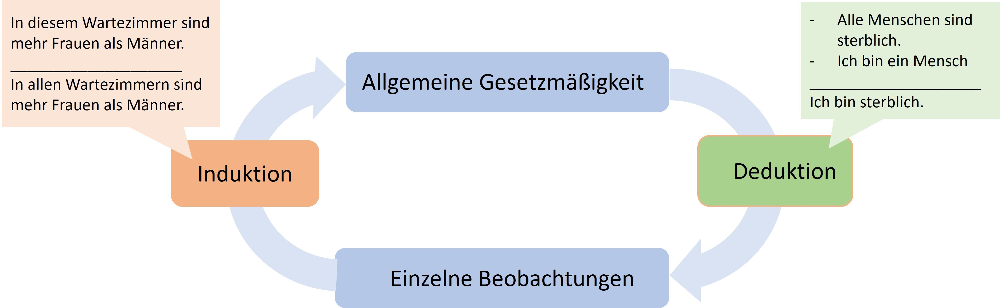
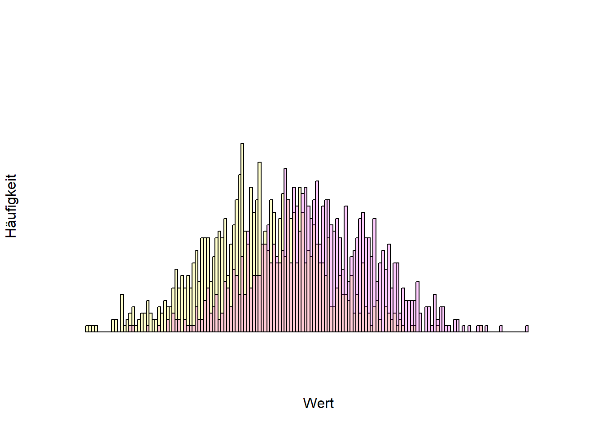
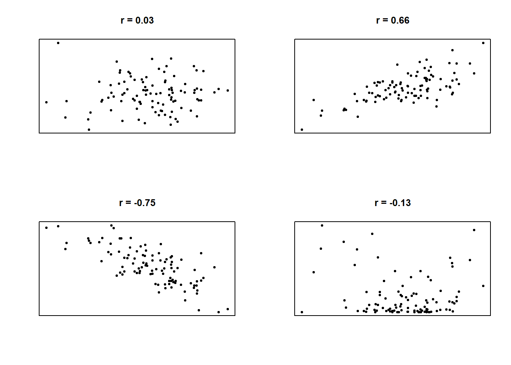
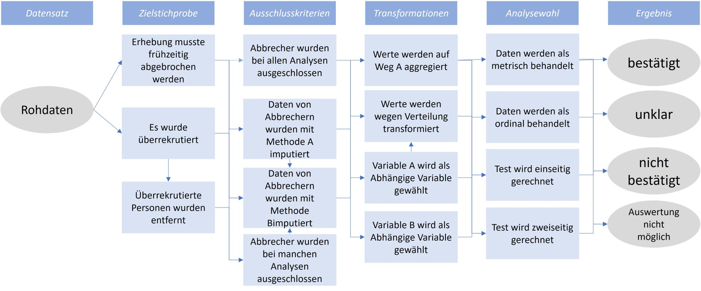
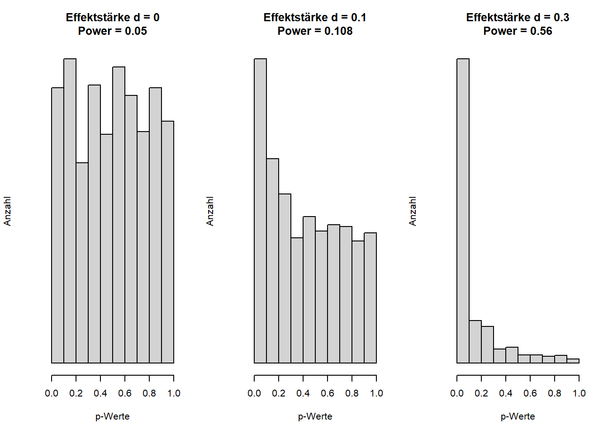
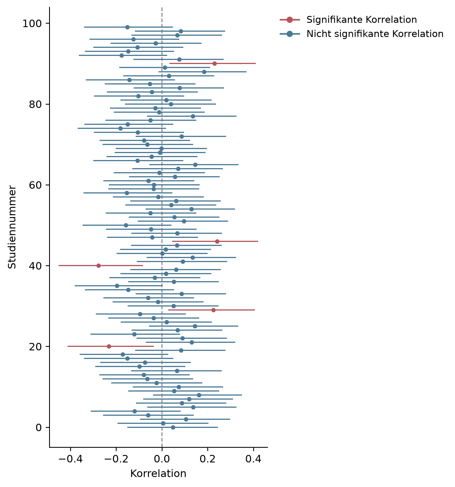
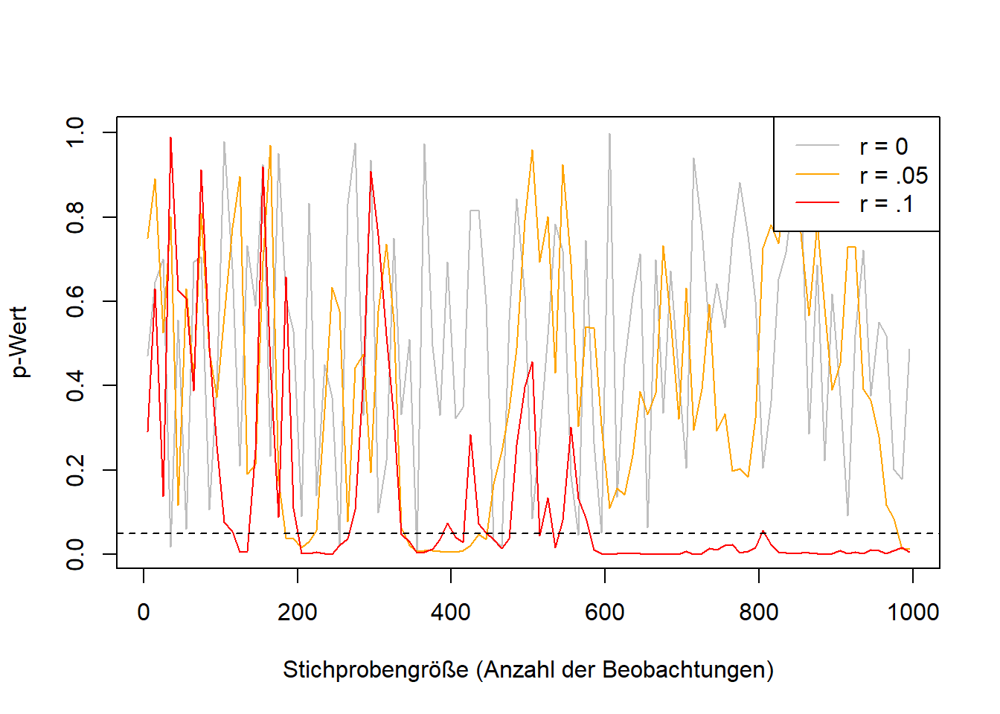

In everyday thinking, the myth still often prevails that science is distinguished from non-science by *the scientific method*. That is false [@Feyerabend.19752002]. It is true that scientific knowledge differs from everyday knowledge (and also from religion) through a higher degree of systematicity [@HoyningenHuene.2013], but there is neither a single nor a constant scientific method. Instead, methods have changed over time, and that is a good thing. New technologies enable, for example, highly precise measurements using electron lasers in physics, 3D scans of artifacts that otherwise only a few people would ever see in the historical sciences, or databases of voluntarily provided and anonymized chat logs in the social sciences (<https://db.mocoda2.de/c/home>).

Just as a hammer or other tool is neither good nor bad, methods too are neither good nor bad, neither right nor wrong -- rather, they are used *appropriately and correctly*, or they are misused. Instead of "misuse," the social sciences speak of questionable research practices, or QRPs for short. They allow researchers to generate the findings they want. In what follows, widespread and frequently applied [@John.2012] techniques are presented [for an overview of the research on this topic over the last 50 years, see also @Neoh.2023].

### Exploratory versus confirmatory research

Understanding questionable research practices (QRPs) requires an important methodological distinction: like a walk, a scientific investigation can be exploratory or goal-directed. Sometimes one strolls freely through the area and makes new discoveries along the way; sometimes the destination and the route are clear and determined in advance. In a scientific context, this is referred to as exploratory and confirmatory research. In exploration, at most the research question and rough features of the method are fixed; in a confirmatory test, everything is worked out in advance: the procedure, the possible results, and explanatory approaches for every possible outcome. A specified hypothesis, together with its associated theory, is then either confirmed or not. Neither approach is superior to the other. Investigations in a largely unexplored area typically begin with exploration, while more prior research goes hand in hand with clearer expectations. It should be noted that these are extreme types of research that form a spectrum, and that only both approaches together allow for genuine gains in knowledge. Within the hermeneutic circle (simply put, "the circle of understanding"), a general regularity is formulated from individual observations (*induction*), and this regularity is subsequently tested against further individual observations (*deduction*). Depending on the regularity in question, deduction can be logically necessary, since a further statement is inferred from previously established statements. The prior assumptions are called *premises*, and the *conclusion* follows from them. If both premises are correct, the conclusion must also be correct. Induction, by contrast, is not a necessity [see the *problem of induction*, @Hume.17482011].

{width="100%"}

Problems arise when exploratory research is communicated as if it were confirmatory -- that is, when it is presented as though a single observation had confirmed an already-formulated regularity, rather than merely having inspired it. This kind of faulty logic is called circular reasoning: the regularity holds because of the observation, and the observation matches the regularity.

{width="100%"}

#### Methods of data generation

Scientific disciplines typically draw on many different methods. Ideally, findings are independent of the method that led to their discovery, and different methods lead to the same finding. Typical methods in the social sciences include surveys using standardized questionnaires, behavioral observation via video recordings followed by coding of behaviors by multiple people who are unaware of the study's purpose, indirect methods [@Schimmack.2019] in which something other than the actual target construct is asked about, behavioral measures such as eye tracking, or simulation studies, which are used, for example, to compute traffic flows on the basis of predetermined principles or to predict panic attacks [@Robinaugh.2021]. These methods almost always generate data -- for instance, a table in which data are recorded across several columns for each observational unit (e.g., each participant) and which are then almost always analyzed statistically. The need for such analysis arises because the observed regularities are not absolute laws in the sense of "all male babies weigh more than all female babies," but rather statistical regularities in the sense of "on average, male babies weigh a few hundred grams more than female babies shortly after birth, but not every male baby weighs more than every female baby." A comparison of height by sex can be seen on [Statista](https://de.statista.com/statistik/daten/studie/1825/umfrage/koerpergroesse-nach-geschlecht/).

The following figure shows the frequencies of different values (a *histogram*). The further to the right a value is, the higher that value is (e.g., birth weight), and the higher the bar, the more often that value occurs. The yellow and purple distributions overlap, meaning that not all yellow values are lower than all purple values. On average, however, the yellow values are lower.

{width="100%"}

::: callout-note
## Statistical significance

One of the most widely used methods in the social sciences (and beyond) is statistics, more precisely *inferential statistics*. Here, a limited set of observations (e.g., completed questionnaires from 100 people) is generalized to all possible observations (e.g., all people). The relationships under investigation are rarely clear-cut, but statistical regularities are common. Characteristic of this is a certain *element of chance*. If you weigh a recently born male and female baby, the probability is very high that the male baby weighs more. But it also frequently happens that this is not the case. The situation is similar with a fair coin -- one that on average lands on heads and tails equally often: it is unlikely that it will land on heads on all four out of four tosses, but landing on heads once or twice does happen fairly often (specifically, in 6.25% of all cases in which a fair coin is tossed four times in a row).

Inferential statistical tests now assume that, when looking at a statistical relationship (e.g., sex and birth weight, body weight and height, parents' education level and children's education level), "only chance is at work" [@Roseler.2022f]. Under this assumption, it is calculated how often an observed relationship of the observed strength would occur if there *actually* were no relationship at all. For example: "that a fair coin lands on heads four times happens in 6.25% of all cases." For six tosses, it would be 1.5625%. The art of statistical inference lies in finding the point at which researchers conclude that chance was not at work, because the calculated probability is so low. Conventionally, this threshold lies at 5%, for new findings sometimes at 0.5% (Benjamin et al., 2018), and in especially precarious cases even lower. In technical terms, this is called an *alpha level* or a *significance level*, and the calculated probability is called the *p-value*. p-values below a certain percentage (e.g., 5% in most social sciences[^probleme_methoden-1]) are called *statistically significant*, or *significant at the 5% level*. Researchers would thus say that a coin is *not* fair if it lands on heads six times in a row (even at five times, which occurs in 3.125% of cases). In doing so, they accept that, if the coin actually is fair, they will draw a wrong conclusion in 5% of all cases.

On the other hand, it is entirely possible for a coin to be unfair, landing on heads 60% of the time and on tails 40% of the time, for example.
:::

![A single study does not yet lead to certain knowledge. Even if an investigated relationship does not actually exist, it can appear by chance in the data. And even if a relationship does actually exist, random fluctuations may prevent it from showing up in the data. Open science practices are meant to restore the state shown in the boxes on the left. From Röseler, L. (2021). Wissenschaftliches Fehlverhalten \[Figure\]. https://osf.io/uf7gz/. Licensed under CC BY-Attribution International 4.0.](images/freiheitsgrade.jpg){width="100%"}

[^probleme_methoden-1]: In particle physics, statistical models are also used. There, instead of the 5% significance level (1.96 sigma), the 5-sigma criterion is applied, which corresponds to an alpha level of 0.000000573%.

### Researchers' degrees of freedom

Running complete studies multiple times is very costly. Although it is a relatively reliable path to significant p-values, there are far more economical solutions. Most analyses are many times more complex than the coin-toss study described above. Let us consider the still very simple significance test for a correlation coefficient. The coefficient is a number between -1 and 1 and describes the type of relationship between two variables (e.g., income and life satisfaction). 0 means that there is no relationship; positive values mean that when one variable has high values, the other also has high values; and negative correlations mean that when one variable has high values, the other tends to have low values. @fig-korrelationen shows various correlations.

::: callout-note
## Correlation

In statistical reports, *r* denotes a *correlation coefficient*, usually the *product-moment correlation* (also known as the Bravais-Pearson correlation). Correlation coefficients are standardized values for the relationship between two variables. These could be the intelligence and salary of several people, or the top speed and weight of several cars. Correlation coefficients always lie between -1 and 1. Values below 0 mean that the higher one variable is, the lower the other is (negative relationship). Values above 0 mean that the higher one variable is, the higher the other is too (positive relationship). 0 means that the two variables involved are independent of one another. The 98 in parentheses is the number of observations minus 2 and is referred to as degrees of freedom[^probleme_methoden-2]. The correlation value of .420 (or 0.42) means that a positive relationship was observed. It is also important to note that this only captures an overall positive or negative relationship (*linearity*). So if, for example, a U-shaped relationship is present (bottom right in the figure), this will not be reflected in the correlation.
:::

[^probleme_methoden-2]: The logic behind the term is comparable to a formula with several variables and the question: "How many variables' values do I need to know in order to calculate the rest?"

{#fig-korrelationen width="100%"}

Although this is a very simple test, it involves many decisions. Even after data collection, decisions must be made: Which of the surveyed people will be used for the test? Should any people be excluded, and if so, why (e.g., extreme values or implausible values)? How are the values of the variables computed? Which type of correlation should be used (e.g., Bravais-Pearson, Kendall, or Spearman)? Is there an expectation about the direction of the correlation (directionality of the hypothesis)?

These questions correspond to degrees of freedom -- that is, researchers have flexibility regarding which options they choose. None of the options is inherently superior to all the others, and each decision can be justified to some extent. The problem with this flexibility is that the results depend on it, and depending on the decisions made, the result can turn out to be a positive correlation, a negative correlation, or no correlation at all. The more complex the investigation and the statistical procedure, the greater the flexibility in data analysis. In itself, these degrees of freedom are not a bad thing; the problem only arises when just those results that are easy to publish or that fit researchers' beliefs are presented. This practice is called HARKing (hypothesizing after the results are known) and constitutes a form of circular reasoning. The hypothesis that was tested comes from the data, which of course confirm it. Various solutions allow for the reduction or complete elimination of degrees of freedom (e.g., preregistration). It is also possible to communicate the approach as exploratory, i.e., not planned or determined in advance.

In the data analysis process, the analogy of the "garden of forking paths" is used. In a simplified (!) example in @fig-forkingpaths, we have 3x4x4x4 = 192 different results, which together cover the entire spectrum of possible conclusions -- regardless of whether our hypothesis is correct or not.

{#fig-forkingpaths width="100%"}

Demonstrations of the *garden of forking paths* exist for a wide variety of fields. The dependence of results on analytical choices has already been shown for evolutionary biology [@Gould.2023], social policy [@Breznau.2022], structural equation modeling [@Sarstedt2024-ov], and linguistic analysis [@Coretta.2023].

### Typos

Data are often analyzed using advanced software, and the results then have to be laboriously transferred into the report. This is where typos quickly creep in. @nuijten2016prevalence developed an algorithm that automatically detects reported significance tests, recalculates them, and flags inconsistencies. They found that, in major psychology journals between 1985 and 2013, roughly half of all articles contained at least one error. These "typos" were not entirely random; rather, erroneous values tended to favor positive findings. Such transcription errors also occur in meta-analyses [@Lopez-Nicolas2022-gv]. And even citations are frequently erroneous: across various scientific disciplines, [@Smith2020-nm] found that in 25% of all examined citations, the claims attributed to the cited work were not actually supported by the original articles.

### P-hacking

The p-value in statistical tests indicates how probable the observed pattern is, given a previously assumed pattern. For a correlation, this usually means: how probable is it to observe a correlation of the magnitude found, if there is actually no relationship (i.e., *r* = 0) between the variables under investigation? Concretely, this could mean: how probable is it that, in my dataset of 100 people, the correlation between intelligence and age is exactly *r*(98) = .420, if I actually assume that the two variables are unrelated?

The assumption of no relationship built into the significance test is called the *null hypothesis*. If the observed pattern is extremely improbable under the null hypothesis (often below 5%), this is referred to as a statistically significant relationship. It is important to note that significance here is to be understood purely in the statistical sense. The question of how meaningful a finding is for the world and for life cannot be answered with statistics within this framework. Because p-values are probabilities, they lie between 0 and 100%.

Among the QRPs (questionable research practices), p-hacking is another category that in turn encompasses several distinct techniques. P-hacking refers to researchers using their degrees of freedom to make the p-value "significant," i.e., to bring it below 5%. A frequently mistaken assumption about p-values is that high p-values indicate the *absence* of a relationship, or that p-values are only low when a relationship actually exists. In fact, p-values tend to be small when a relationship exists that can also be detected given the amount of data collected. If no relationship exists, p-values are uniformly distributed, meaning that all p-values occur equally often. Given the definition above, it follows directly that out of 100 studies conducted, roughly five will tend to show a significant relationship *even if none actually exists*. This fact enables a variety of p-hacking methods. Simonsohn et al. (2014) showed that the probability of obtaining a significant result, when there is actually no relationship in the data, can rise from 5% to roughly 60%. @fig-pwerte-power shows the distribution of p-values at various levels of statistical power (i.e., the probability of detecting a relationship of a given size when it actually exists).

{#fig-pwerte-power width="100%"}

The chance of obtaining significant p-values even when the tested hypothesis is not actually true can be increased by "slicing" the sample (e.g., analyzing only women, only employed people, or only people older than 30), by collecting additional data ("optional stopping"), or by using several central variables (for example, measuring intelligence with three different tests and correlating each test individually with age). Even changing small parameters in the statistical tests (e.g., using a non-parametric Spearman correlation instead of the Bravais-Pearson correlation) increases the chances of a significant result (see Table Y). Some forms of *p-hacking* can be tried out here, for example: [https://shinyapps.org/apps/p-Hacker/](https://shinyapps.org/apps/p-hacker/){.uri} [@Schonbrodt.2016]. @Wicherts2016-br propose a checklist for avoiding p-hacking.

| **Technique** | **Proportion of significant results** |
|------------------------------------|------------------------------------|
| Multiple dependent variables with a correlation of r = .5 among them | 9.5% |
| Collecting 10 additional observations per group | 7.7% |
| Including an additional variable (e.g., sex) in the model | 11.7% |
| Excluding (or retaining) one of three groups | 12.6% |
| All techniques combined | 60.7% |

: Probability of obtaining a significant result through the application of various p-hacking techniques, following @Simmons.2011, Table 1. The proportion of significant results should correspond here to the fixed 5% alpha error rate.

::: callout-tip
## Faking data for dummies

Hussey and Hughes [-@Hussey.2018] (and, building on this, Sarstedt and Adler [-@sarstedt2023advanced]) self-mockingly proposed methods to make p-hacking even easier. On this website, users can generate random numbers within a desired range: <https://mktg.shinyapps.io/extra-p_ointless/>.
:::

### Selective reporting

When planning a study in the social sciences, the question of how a particular construct should be measured often arises. For intelligence, political opinion, life satisfaction, and many other variables, there is no single test but rather many measurement instruments, some of which are only weakly related to one another. At the same time, the theories being tested are usually vague and do not dictate which measure should be used to assess a construct. Theories are thus often agnostic with respect to measurement methods -- or put differently, according to the theory it does not matter how the variable is measured. If a study then chooses different measurement methods for a construct, the theory would need to be confirmed equally across all tests. If that is not the case, the theory should be revised. Contrary to this recommendation, and in order to maximize the chances of publishing their results, researchers often report results *selectively*. Instead of all results, only the "best-fitting" or "most exciting" ones are reported. As has become clear above in the discussion of p-hacking and researchers' degrees of freedom, this leads to relationships being found that do not actually exist. If, for example, three different and independent measures are used to test a hypothesis, the probability of at least one significant result rises from 5% to 14%.

Selective reporting: out of a hundred correlations involving unrelated random numbers, on average five significant ones are to be expected -- and this occurs *purely by chance*. None of them, taken together, are significant. In order to improve their chances of publication, and thereby their chances of a permanent position, researchers frequently report only the most exciting part of their results, thereby distorting the overall picture.

{#fig-selektiv width="100%"}

### Optional stopping

If a study's test is rerun after each new observation and the p-value is examined each time, there are two possible trajectories for the p-value: if a relationship actually exists between the variables being studied, the p-value will *converge* -- that is, it will approach a particular value, namely 0. The probability of the observed result becomes ever lower as the sample grows larger. A coin landing only on heads is more unusual if it has done so 100 times than if it has done so three times. If no relationship exists, the p-value will not, as is often expected, tend toward 1, but rather *fail to converge*. It will instead behave chaotically, sometimes high and sometimes low -- and will also turn out significant more often than expected. Researchers exploit this fact through *optional stopping*: they keep collecting data until their hypothesis is confirmed. Incidentally, this problem does not arise for correlations and other effect size measures. These converge, depending on their magnitude, from around 250 observations onward (Schönbrodt & Perugini, 2013).

{#fig-pwert-konvergenz width="100%"}

### Presenting calibrated models as planned models (*overfitting*)

Complex statistical models have many adjustable parameters. It is possible to make all the countless decisions before applying a model to data, but typically other calibrations are tried out, and one that was not originally planned turns out to fit better. This means, for example, that certain variables are included in a model in order to maximize its predictive power. Many models even involve various algorithms that decide, based on fixed rules, what the model should look like. A model is thus fitted to a data pattern. If this procedure is disclosed transparently, that is perfectly fine. Problems arise when the best model found is presented as though it had been the planned model. In social science research, the pattern present in the data almost always also contains noise -- that is, fluctuations attributable to measurement imprecision or other unknown influences. These influences fluctuate by definition (in psychological test theory, for instance, this is referred to as *error*, an unsystematic fluctuation that averages out with repeated measurement). In future investigations, a model fitted to past data and the noise it contains will necessarily perform worse, because the noise in the new data is different. This is referred to as an "overfitted" model, or overfitting.

### People's tendency to confirm themselves (*confirmation bias*)

A particular problem in scientific methods is confirmation bias. The phenomenon is not clearly defined in the scientific literature [@Nickerson.1998]; here, I mean by it the tendency of people (or, in this context, researchers) to find the patterns they expect to find. Confirmation bias is itself based on scientific findings [@Oswald.2004] and has been applied by researchers to themselves [@Mynatt.1977; @Yu.2014]. These considerations lead close to logical absurdities and paradoxes -- self-mockingly, @Nickerson.1998 himself notes the possibility that all findings on confirmation bias could themselves merely be products of the same bias, which would in turn confirm the existence of confirmation bias (p. 211). In practice, there is a risk that researchers do not uncover truths but instead twist everything so that their preconceptions are confirmed. Ludwik @Fleck.19352015, in his sociology of science -- which forms the foundation for Thomas Kuhn's work on scientific revolutions [@Kuhn.19701996] -- goes a few steps further still: he argues for a model of scientific progress in which the goal is not to get closer to the truth, but to understand problems, to the best of one's knowledge, against their social background. This does not mean that there is no truth, only that truth is not simply the correspondence of statements with facts. In place of this *correspondence theory of truth*, often held by researchers, Fleck offers a *consensus theory* of truth: the agreement of many people is what matters. Scientific facts are not "discovered" by individuals but created by a collective. Confirmation bias then manifests itself in the way findings that contradict the consensus are screened out, and current views are clung to for as long as possible. Although philosophical theories of truth go beyond the scope of this book, it should be noted that none of the three theories of truth (correspondence, consensus, and coherence) is tenable [@Albert.2010, *Münchhausen trilemma*].

### Data fabrication

The practices discussed so far are often described as questionable. Some researchers consider this a euphemism, since as a researcher one ought to know enough to recognize that the techniques described above are *not* scientific and clearly do not serve the generation of knowledge. They clearly hinder scientific progress, endanger trust in science, and lead to enormously high costs. Unfortunately, many researchers today are still unaware of these problems. "That's just how we were taught, and how it's always been done," people say. That certain studies could not be replicated was, in some cases, already known to many people -- they simply did not think it possible to record this in the scientific record. In any case, the term "questionable research practices" suggests that researchers engaging in them are operating in a gray area. In my view, this is only the case because, if researchers lost their jobs for having engaged in p-hacking, not many researchers would be left.

The situation is different when it comes to fabricating and manipulating data. How often data manipulation or fabrication occurs is uncertain, and estimates are difficult to make. A meta-analysis of surveys on this topic estimated that between 0.86 and 4.45% of all researchers admitted to having manipulated data. 72% reported having engaged in questionable research practices [@Fanelli.2009]. @Stroebe.2012 later compiled examples of data fabrication and recommended peer review and replication as fraud detectors. A more recent and extremely extensive study by @Gopalakrishna.2021 reported that 8.3% of all respondents had manipulated or fabricated data and 51.3% had engaged in questionable research practices (Table 2), confirming the scale of the problem. Depending on the discipline, further problems arise, such as the reuse of previously published biomedical images, which was found in approximately 3.8% of all published articles [@Bik.2016]. While it was long assumed that fraud occurs only in very rare cases, the real problem is above all that it is rarely uncovered. How often research is "fake" has hardly been studied, and estimates vary widely [@Heathers2024-ju]. Cases of fraud that have come to light have resulted in the retraction of the respective scientific articles and often in consequences for the careers of those responsible. Retractionwatch.org maintains the world's largest database of retracted articles (as of December 2023: 49,628 articles): [http://retractiondatabase.org/](#0){.uri style="font-size: 11pt;"}.

It is a rather bleak fact that methods for fabricating data are, on the one hand, becoming ever easier [@Naddaf.2023], while researchers who expose errors are occasionally sued. For example, the authors of Datacolada.org, who have already exposed problems on multiple occasions, were sued by Francesca Gino over one of their publications (<https://datacolada.org/109>), in response to which thousands of researchers raised funds to support the financial cost of the legal proceedings (<https://www.gofundme.com/f/uhbka-support-data-coladas-legal-defense>).

### Further information

- This English-language podcast discusses how, and whether, fraud in science can be stopped: <https://freakonomics.com/podcast/can-academic-fraud-be-stopped/>.
- Daniel Lakens describes what the replication crisis felt like from the perspective of a young researcher: <http://daniellakens.blogspot.com/2020/11/why-i-care-about-replication-studies.html>.
- @nagy2024bestiary systematically catalog questionable research practices (QRPs) in their *Bestiary*.

------------------------------------------------------------------------
