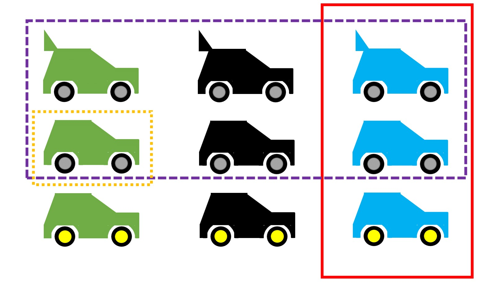

Scholarship works with theories. What these look like exactly differs considerably between disciplines. While the natural sciences often work with mathematical models, that is, formulas that describe the relationship between variables explicitly and unambiguously and allow predictions, the social sciences often work with verbal theories in the style of "X and Y are positively related" or "the higher X, the higher Y," and the traditional humanities work, for example, with verbal explanations. Verbal theories have the advantage of tending to be easy to understand and broadly applicable, but the terms they use are often subject to individual, cultural, or temporal influences, and discussants risk talking past one another in scholarly discourse.

For formal theories, all variables involved are precisely defined, and such theories often have a strongly restricted scope of validity (e.g., many physical laws hold only under tightly controlled conditions, such as in a vacuum, at a specific temperature, and so on). A concern raised in the context of the replication crisis is that theories are not clear enough to predict when replications will succeed, and that this is one of the causes of low replication rates [@buzbas2023tension; @Smaldino.2019]. A theory about the consequences of identifying with gender roles, for example, must account for changes in gender roles and their particularities across different countries. It is hardly surprising that one and the same experiment on this topic yields different results in the USA in 1980 than in Germany in 2020. What is problematic, however, is that -- even though such qualifications seem sensible and necessary for many social-science theories -- statements to this effect are rarely made.

Verbal theories are not inherently less scientific: within their respective fields, scientific theories always stand out from everyday explanations through their particularly high degree of systematicity [@Hoyningen-Huene2023-ec]. However, fields that place value on predicting events cannot do without formal theories [@Muthukrishna.2019]. It should be emphasized that certain disciplines place *no value* on prediction (e.g., history, or fields that proceed primarily hermeneutically). Fields such as psychology, quantitative sociology, and parts of the humanities ("digital humanities") are currently moving closer to formal models -- in social psychology, there was already a call to formalize theories once before, during a crisis in the 1960s [@Lakens.2023]. Because theories lacking objectivity are rarely used by different researchers and, due to their flexible interpretation, are difficult to refute, an enormous quantity of useless theories has emerged there [@Ferguson.2012]. Among these are also mutually contradictory theories: for instance, @Banker.2017 argued that "ego depletion," that is, the depletion of self-control resources, causes people to rely more on cues from other people (p. 2), whereas @Francis.2018 conjectured the opposite -- that depletion prevents cues from being processed at all. Both provided data supporting their respective theories, yet a follow-up investigation found that both were probably wrong [@Roseler.2020c].

@Robinaugh.2021 discuss examples of the conversion of verbal theories into formal ones. This process results in new, more specific predictions that can be derived. When a theory makes more precise predictions and the set of possible events that would contradict the theory grows, this represents an increase in *empirical content* [@Glockner.2011; @Popper.19592008].

::: callout-tip
## Empirical Content and Strong Inference

Theories can differ in their empirical content. Concretely, this refers to how specific their predictions are. The more *possible* observations *would* refute a theory, the higher its empirical content.

Let us take the case where our theory allows us to make predictions about what kind of car will drive along a particular street at a particular time. The figure shows all possible cars. For simplicity, our example world contains only nine different cars, which differ in terms of the features *color* (green, black, blue), *rear spoiler* (with, without), and *wheel color* (gray, yellow).

- The purple theory states: *The observed car has gray wheels*. Without a theory, all cars would be equally likely to us; the purple theory "forbids" the car from having yellow wheels. It rules out 3/9 of the cars.

- The red theory states: *The observed car is blue*. The probability of refuting it would be higher in our sample world, namely 6/9. Because the red theory is, so to speak, a riskier bet *a priori* -- that is, without further prior knowledge -- it has higher empirical content.

- The orange theory has the highest possible empirical content: *The observed car is green, has no rear spoiler, and has gray wheels*. It rules out all but one case (8/9).

The example with the nine possible car types is, of course, highly simplified. In certain fields, however, researchers occasionally manage to reduce the results of experiments to a few possible outcomes and thereby weigh theories against one another. @platt1964strong calls this the *method of strong inference* and argues that fields proceeding this way experience rapid progress. Building on this, @Smaldino.2017 calls for more theories or models and argues that researchers should always offer several explanations simultaneously. This can have the advantage that researchers do not commit to a single possibility and that theories are not treated as someone's property. As long as a theory can be clearly attributed to one person, there is a risk that criticism of the theory will be confused with criticism of the person.

{width="100%"}
:::

### Deduction and Induction

Methods are being reformed, and scientists discuss how science works, how it should proceed, and which methods are sensible or nonsensical. As becomes clear from the hermeneutic circle, one path to knowledge consists of combining a set of observations into a regularity or law (*induction*), while another consists of deriving predictions about observations not yet made from a law or theory (*deduction*). This distinction is repeatedly neglected or obscured in scientific discourse. For example, a debate in consumer psychology revolved for years around which path was better, even though both paths are equally legitimate and complement one another [@Calder.1981]. Something similar applies to conflicts between qualitative and quantitative approaches, which, formally considered, tend to proceed inductively or deductively, respectively [@Borgstede.2021]. In replication research, the inductive side has traditionally received more attention [@Huffmeier.2016; @yamashita2024replicate]: every difference between a replication study and the original study is cited as a possible cause for the failure of the replication attempt, in order to preserve the trustworthiness of the original findings [@Baumeister.2016b]. This overlooks the fact that minor differences between the original and replication study (e.g., the measures used, the average age of participants, the language of the instructions) are not captured by theories -- and should therefore, according to the theories themselves, be irrelevant -- and that a failed replication clearly reveals the limits of the theory, from which recommendations for modifying the theory can be derived [@Cesario.2014; @Dijksterhuis.2014]. An overview of the approaches can be found in the following table.

| | | |
|------------------------|------------------------|------------------------|
| **Facet** | **Deductive Approach (Theory-driven)** | **Inductive Approach (Phenomenon-driven)** |
| Generalizability lies in... | the theory: it is maximally general a priori (e.g., it holds for all people until demonstrated otherwise). | the data: only diverse observations across different contexts allow the assumption that the phenomenon is universally valid. |
| Change in generalizability | Generality decreases with more observations. | Generality increases with more observations (provided they are confirmatory in nature). |
| Type of test | Predictions of the theory are primarily subjected to attempts at *refutation*. | Repeated observations *confirm* the original individual case. |
| Choice of study setting | Student samples from a single country or laboratory studies are unproblematic. | The context of the study should reflect the target conditions (e.g., when applying the findings in practice) as closely as possible. |

: Characteristics of inductive and deductive approaches; taken and adapted from an unpublished manuscript by Röseler & Leder.

### Auxiliary Hypotheses

Replication failures can be explained via the following paths:

1. Type I error in the original study: The original finding was merely a chance finding or arose through scientific misconduct (see the chapter "Researchers' Degrees of Freedom").

2. Type I error in the replication study: The original study was correct; the replication study made an error (e.g., too small a sample, poor calibration of instruments, or scientific misconduct).

3. Boundary condition of the phenomenon: Both studies are trustworthy. The replication study *differs* in a way that matters for the theory (e.g., the replication study was conducted with people from a different country, and the theory only holds for people from the "original country").

Option 3 is constructive and accepts both individual findings as robust. This requires a theoretically relevant difference between the original and replication study, which, given the infinite number of possible important factors, applies in most cases [@Smedslund.2015]. This path can then be used to modify the theory or to formulate an additional theory that must likewise be taken into account for the context of the study. Things become difficult when researchers conduct a replication to the best of their knowledge, it "fails" (that is, it does not demonstrate what it was meant to demonstrate), and other researchers criticize the replication for having done something "wrong." After @Hagger.2016b, in consultation with Roy Baumeister, tested his ego depletion theory with a large-scale study, @Baumeister.2016b criticized that it should have been expected from the outset that the study would not work, and described the study as misguided. Vohs, who was a co-author of the critique, conducted another large-scale replication study a few years later. Although this time the researchers were able to follow their own advice, they again failed to find the expected effect [@vohs2021multisite].

### Further Information

- @ramminger2023vermessen discusses a philosophical perspective on the relationship between theory, measurement, and replication.

- @Yarkoni.2019 argues that replication problems originate in the generalization of results to theories.

- In a talk, Fanelli discusses the complexity of research as a reason for replication failures and proposes a theory for measuring complexity [@fanelli2022metric]. A video of a talk is available online: <https://www.youtube.com/watch?v=CEAV7420jBk>.

------------------------------------------------------------------------
