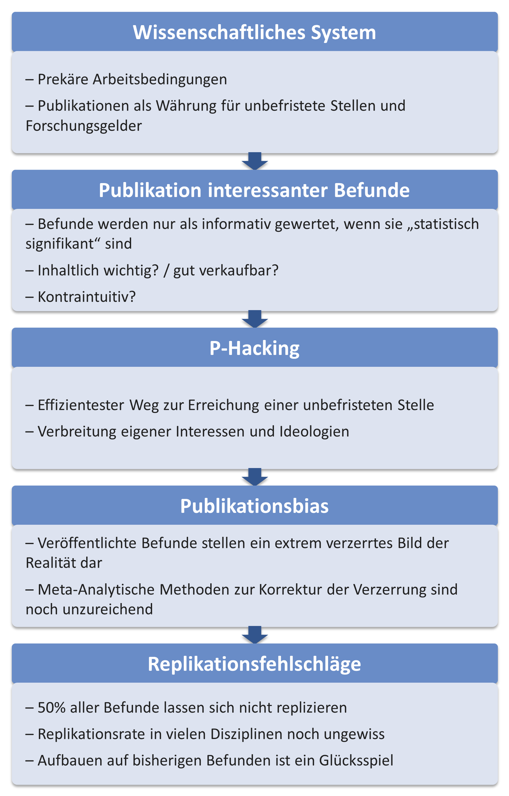

In a conversation about preregistration -- a method for increasing the replicability of a finding -- a colleague once replied: "That's all well and good, but as long as the system doesn't change, replication rates won't change either." How can we make sense of this objection? Let us approach this from the other end: at the latest since the Reproducibility Project Psychology (Open Science Collaboration, 2015), most psychologists have understood that there are serious problems with the replicability of findings. Where exactly do these come from? An important problem here is *publication bias*, which refers to the fact that when scientific reports are published, a selection has to be made, so that only certain results end up being published (e.g., results that support a particular theory). This creates a distorted picture of reality. Researchers often even compile reports using only certain findings. "Failed experiments" -- that is, ones in which a hypothesis was not confirmed or a theory was not supported -- end up in the drawer [the *file-drawer problem*, @Rosenthal.1979; @Sterling.1959]. In more extreme cases, scientists make use of various, largely accepted methods to present the data in a way that supports the hypothesis, or act as if what can be read from the data was the hypothesis from the very beginning [HARKing, @Parsons.2022]. But what drives people who chose an academic career mainly out of interest in how the world works to unconsciously embellish the truth, or even to deliberately manipulate it? At the beginning of the complex process that has led to the replication crisis stands the current academic system: a large proportion of people employed in academia operate under extreme pressure and precarious working conditions. In order to have their contract renewed after one or two years, they must demonstrate publications in journals that are as prestigious as possible. These are obtained through especially striking and exciting results. The incentive system of academia therefore rewards not truth, accuracy, modesty, or transparency, but above all the things that are not within a researcher's control: exciting and unambiguous results [@Bakker.2012].

The process leading from precarious working conditions to low replication rates is illustrated here. In the following chapters, the problems and possible solutions are discussed in detail.

::: {.content-visible unless-format="pdf"}
{#fig-struktur width="100%"}
:::

::: {.content-visible when-format="pdf"}
{#fig-struktur height="95%"}
:::

------------------------------------------------------------------------
