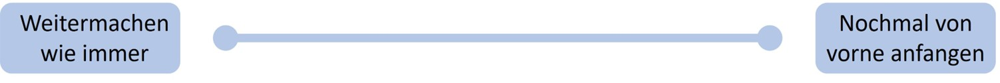

The topic of Open Science and the replication crisis[^umgehenmitopenscience-1]—or crisis of confidence—is difficult to communicate for several reasons. First, it amounts to harsh criticism of science and the scientific system, which can be misused to downplay scientific findings and which endangers trust in science as a whole. The arguments and findings presented here can, for example, be used to criticize political or individual decisions that are based on science. Against this, it should be said: by no means are all scientific findings "wrong" or unreplicable. On many points there is still broad consensus—that is, scientists agree on the truth of the findings.

[^umgehenmitopenscience-1]: This refers to the fact that a large proportion of published replication studies (that is, studies that re-test what is already known) arrive at different results, meaning that original studies often cannot be replicated (see also the following chapters on history and stocktaking).

On the other hand, the problems discussed here go beyond what naturally occurs in almost every scientific field. The more closely one looks, the more likely it becomes that any given scientific finding can be relativized. Contradictions or conflicts can be found everywhere, arise naturally, and are the target of scientific scrutiny. Every researcher can attest: on closer inspection, nothing remains black or white but dissolves into many shades of gray. The replication failures discussed below amount to more than the uncertainty inherent to science: they endanger entire lines of scientific inquiry.

Before we proceed to the details, it is also important to note that, at present (autumn 2023), most of the problems discussed in this book have not yet been solved, or have only been partially solved, and are hotly debated on a weekly basis. After a decade of the Open Science movement, a point has been reached at which most scientists have developed an awareness of the problem. Some are familiar with proposed solutions, but these have neither become fully established, nor is it clear which problems have already been solved.

I understand Open Science as a large trigger warning that should precede the social sciences and that reads: Attention, we currently have very serious problems here. It is entirely possible that half of everything we believe we know is simply wrong. Opinions on the Open Science movement are by no means uniform, however: one can span a spectrum here between "Should we really spend the next 20 years finding out which findings of the last 100 years are correct? Let's just start over from zero," and "Actually, this is all quite normal; I see no reason to speak of a 'crisis' here."

{width="100%"}

The problem is especially large for textbooks. Imagine you have written a book about a branch of psychology (social psychology is often the showcase example here) that rests on decades of research, hundreds of publications, and thousands of studies. Here it hardly helps to ignore the book entirely. But replicating all the studies yourself is not practicable either. What is clear to most scientists is this: things cannot continue the way they have so far. A fifty percent guarantee for scientific findings should not be the standard for something that calls itself science. But we do not need to start from scratch either.

::: callout-tip
## Open Science vs. Open Scholarship

Unlike German *Wissenschaft*, which covers all scholarly disciplines, English "science" is usually taken to mean only the natural sciences, so that, strictly speaking, "Open Science" excludes the humanities. Because English therefore has to address all fields jointly as "Science and Humanities," the term "[Open Scholarship](https://forrt.org/glossary/english/open_scholarship/)" is often used instead [@Parsons.2022].
:::

Further information: reactions from various members of the German Psychological Society (DGPs) to the board's official statement, taken from a discussion forum, can be read online: <https://replicationindex.com/wp-content/uploads/2022/12/DGPs_Diskussionsforum.pdf>.

------------------------------------------------------------------------
