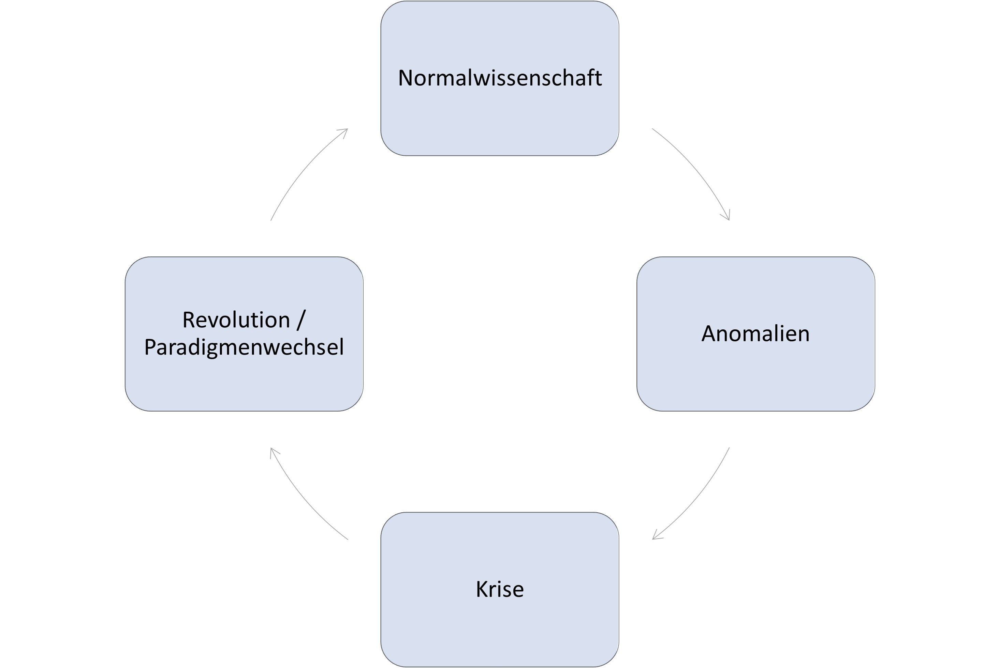
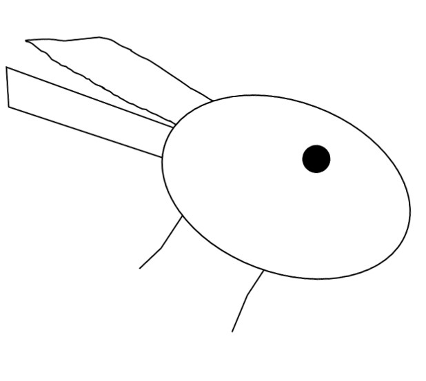

Since the low replicability of psychological studies became widely known, the scientific system has changed in many respects with regard to its openness and transparency. Some journals now require, as a condition for publishing research articles, that the data be made publicly available or that an explanation be given for why this is not the case (e.g., for data that are difficult to anonymize). In rare cases, such as at the journal Meta-Psychology, researchers recompute all the results. As a counter-proposal to the "impact factor" -- a metric that indicates how often a journal is cited and that has been shown to have nothing to do with the quality of the research it contains [@Brembs.2018] -- the TOP Factor was introduced (TOP: Transparency and Openness Promotion). For a list of criteria, it indicates the degree to which they are met by different journals. In other fields, such as business administration or marketing, journals are even rated by a small number of selected researchers using rating scales that are published annually as rankings. TOP Factors, by contrast, are objective, are continually updated, and can be viewed and verified publicly at topfactor.org. For each factor there are four levels: no mention, level 1, level 2, and level 3. Level 3 represents the ideal; with regard to data transparency, for instance, this would mean that an article is published only once the data are publicly available and the analyses have been successfully recomputed (*reproduced*) by an independent person. To score a journal, corresponding points are assigned for levels 1-3 and summed.[^wandel-1]

[^wandel-1]: Social scientists know that summing these values in this way is nonsensical, since level 2 is not "twice as good" as level 1, and the different factors should not always be weighted equally -- yet that is exactly what the arithmetic assumes. Still, as a heuristic estimate of a journal's openness, this approach is more sensible than measures such as the impact factor and the Hirsch index (i.e., *bibliometric measures*).

| **Factor** | **Explanation** |
|----|----|
| Data citation | Most research articles are based on data. Specifically, this concerns the possibility of citing data independently of the articles (e.g., via its own identifier, such as a *Digital Object Identifier* \[DOI\]). |
| Data transparency | Whenever possible, data should be made publicly available. This can be done directly through journals or through so-called *research data repositories*. |
| Analysis code transparency | The analysis code is used to evaluate the research data. Other researchers should have the opportunity to run the code and *reproduce* or check the results. |
| Research materials transparency | Research materials can include questionnaires, images or films shown to participants, but also odors presented, fruits tasted, or software used. Whenever possible, these too should be deposited (in digital form) in a repository. This is naturally not possible for physical objects. For genes, for instance, there are *alphanumeric codes* that researchers use to communicate with one another. |
| Guidelines for describing the study design and analyses | To understand, but also to replicate, a study, it is important to describe the study design in detail. In recent years, for example, some journals have lifted the word limit for the corresponding sections of research articles. |
| Preregistration of studies | See also the section on preregistration in this book: if a study tests hypotheses (i.e., expectations or predictions for the outcome), these should be specified in advance and not adjusted after seeing the results. Ideally, journals require preregistrations for such studies and require researchers to provide a link to them. |
| Preregistration of the analysis plan | The path from data to results is a long one. The results depend on many decisions. To strip themselves of this flexibility, researchers should describe the analysis plan in the preregistration. |
| Replication | Despite their value, there are still many journals that do not publish replication studies. Ideally, journals encourage researchers to submit replication studies to them. |

: Overview of the TOP guidelines.

This change has been driven above all by early-career researchers (ECRs). At many universities in recent years, Open Science initiatives or regular meetings ("Reproducibili-Tea") have emerged, consisting almost exclusively of postdocs (researchers who have completed their PhD and hold a fixed-term research position; in Germany this covers essentially everyone below professor level), doctoral students, and students. In Germany, these have networked together to form NOSI (the German Network of Open Science Initiatives) [@Schonbrodt2022-zn].

### Has the replicability rate increased?

The replication crisis has now been ongoing for more than a decade, and quite a bit has changed. Has this also solved the problem of replicability? For one thing, in many areas it is still not even clear what can be replicated. In marketing, the journal *Journal of Business Research* briefly introduced a replication section [@Easley2013-xt], which was later moved to a different journal. Projects are currently underway to estimate replicability for various disciplines. Their results are, for the most part, still preliminary and unclear. Another project is collecting replication results in order to track, over the long term, how replication rates have changed by discipline and over time. Up-to-date figures are available online [<https://forrt-replications.shinyapps.io/fred_explorer/>, @Roseler.2024]. An evaluation spanning multiple disciplines and years will still require hundreds of additional replication studies.

### The Open Science Revolution as a Paradigm Shift

Historians and theorists of science describe the development of science as discontinuous. Textbooks do not simply keep getting thicker; instead, some chapters get shorter because the knowledge they describe is discarded, while others get thicker because new findings are added. At times, chapters even disappear entirely. One of the best-known models of science comes from Thomas @Kuhn.19701996, who was originally a physicist and adopted and further developed ideas from the physician and sociologist Ludwik @Fleck.19352015. According to this model, knowledge grows for a time, but findings accumulate that are incompatible with the rest of established knowledge. At some point, these so-called anomalies can no longer be ignored. From that point on, the scientific worldview tips over: new theories are devised that can explain the anomalies, and old knowledge is either discarded or integrated into the new theories. This tipping is referred to as a paradigm shift or scientific revolution. Classic examples of such a paradigm shift include the transition from the geocentric to the heliocentric worldview in astronomy, prospect theory for decisions under uncertainty [@Kahneman.1979], which linked psychological and economic models, or -- as is argued here in this book and elsewhere [@Sonning.2021] -- the replication crisis in psychology. In this case, the anomalies are the findings of @Bem.2011 or @Bargh.1996, or isolated replication failures. These were incompatible with existing knowledge, and once many such findings had accumulated, they could no longer be ignored or dismissed. The claim that replication researchers had done something wrong, were unqualified, or had bad luck was no longer a convincing explanation. Unlike classic revolutions in the sense of @Kuhn.19701996, which involve a transition from one theoretical perspective to another, the Open Science Revolution does not center on any particular theory or research discipline being discarded, but rather on the scientific method and the scientific system of the social sciences itself. Moreover, social science disciplines such as economics or psychology do not each have only a single paradigm; they can have multiple independent paradigms [@Hoyningen-Huene2023-ec] -- that is, several strands with little in common that are researched independently of one another. Following Kuhn's philosophy-of-science terminology, alongside "replication crisis" the term *credibility revolution* [@Korbmacher.2023] is also used. For philosophical perspectives, see also @Rubin2023-uu.

{#fig-paradigmenwechsel width="100%"}

A paradigm shift is comparable to an ambiguous image such as the duck-rabbit figure (@fig-entehase), as drawn, for example, by @Wittgenstein.1968. Up to a certain point, everyone agrees that it is a rabbit. But gradually, new insights and perspectives are added. The tipping point is crossed, the duck becomes the accepted interpretation, and no one would take it for a rabbit any longer. With the duck-rabbit image, of course, one can jump back and forth between interpretations at will. In scientific *progress*, however, new knowledge is added and a return to the earlier view becomes very difficult.

{#fig-entehase width="100%"}

From the very beginning of their studies or doctoral training, researchers are trained to deal with findings in accordance with the prevailing paradigm.

::: callout-tip
## It never works on the first try: a paradigm shift in psychology

Already during my studies, I was trained to deal with failed replications in a manner consistent with the prevailing paradigm. This was before the replication crisis had crystallized. In the first study I took part in, in 2012, we tried, for example, to replicate the finding that colorful sets of objects appear less numerous than single-colored sets of the same size. In terms of consumer psychology, this is somewhat counterintuitive — a long-running German TV jingle for Smarties (in Germany, colourful chocolate lentils similar to US M&M's, rather than the tart pressed-sugar discs sold as "Smarties" in the US) promised "lots and lots of colourful Smarties" ("viele viele bunte Smarties") — but it can be plausibly explained from a Gestalt-psychological perspective [@Redden.2009]. After a group of fellow students found the opposite -- namely, that *colorful Smarties actually appeared more numerous than single-colored Smarties* -- we were unable to demonstrate either effect in two follow-up studies of our own. Regardless of whether the Smarties were presented on plates, in cups, or in bowls, regardless of whether the candies were blue, red, yellow, or mixed colors, and regardless of whether quantities were estimated or Smarties were poured from large bottles into containers, our participants were simply not influenced by "colorfulness." Over the following years, I was able, as a teaching assistant, to run further replication attempts. The supervising professor, who was also my mentor, explained: I have honestly never seen a hypothesis confirmed on the very first attempt. After every experiment you get a bit smarter and learn what to do better next time. It's completely natural that it takes a few attempts before you figure out how to confirm the hypothesis. After we had run six studies with a total of 1383 participants, asked the authors of the original study for advice, eaten piles of candy, and still failed to confirm the hypothesis across all the studies, I had lost confidence in the finding.

About six years later, during my doctoral studies, I thought back on those studies and discussed them with the professor. In light of the replication crisis, it had become clear: if you run multiple experiments and the hypothesis is actually false, chance alone will occasionally still produce a confirmation of the hypothesis. This is comparable to the fact that even a fair coin can land on the same side six times in a row. But if you flip 10 coins six times each, it is not at all unusual for one of the 10 coins to land on the same side all six times. Seen from this perspective, the remark that results never seem to come out the way you want them to on the first attempt has a bitter aftertaste: if the hypothesis is false, it is indeed unlikely that it will nevertheless be confirmed -- in a single study. But not if many studies are conducted. In that case, it is actually to be expected that, sooner or later, some study will confirm the hypothesis -- even though it is actually false (!). We eventually published these studies together with several of the people involved [@Roseler.2020].
:::

------------------------------------------------------------------------
