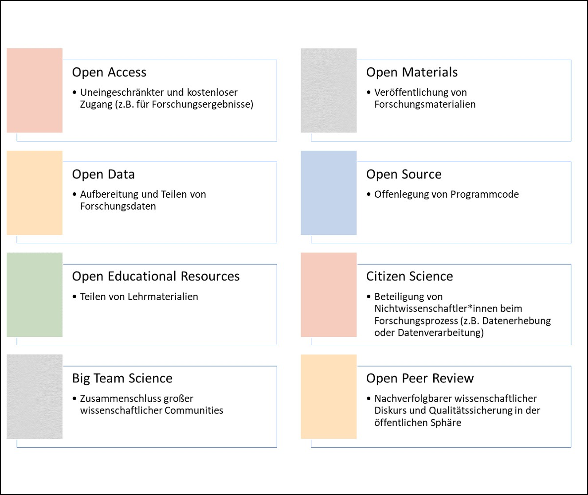

Science is often about details: What exactly happened in the study? What images did participants see, and on what kind of screen? What was the screen's refresh rate, and were the colors calibrated using a machine (e.g., a spectrophotometer)? Scientific investigations and their findings are nowadays described in journal articles. It is not uncommon for one of the details listed above to be missing, unavailable in the supplementary materials, or for the authors to be unreachable because their e-mail address is no longer current. But if a finding depends on exactly such a detail, future researchers will have difficulty bringing it to light. At this concrete level, Open Science means the possibility, for anyone, within ethical and legal limits (e.g., anonymity), to gain detailed insight into the entire scientific process of knowledge generation. It should therefore be described precisely how the study was conducted, what materials were used, what data resulted from it, how that data was processed and analyzed, and finally, what can be learned from it.

At a more abstract level, Open Science refers to a greater degree of openness and transparency in all facets of science. As described, this includes study materials (e.g., questionnaires, images, or videos), the scientific report, and the discourse involved in the peer review of scientific reports by colleagues. But the degree of transparency can also increase at the level of the scientific system itself (that is, institutions, journals, and laws pertaining to science): for example, there are lists of journals whose articles can be read online free of charge (<https://doaj.org>). Finally, openness can also mean holding a conference in a "hybrid format" -- that is, at a specific location, but with the option of online participation -- so as not to exclude people who cannot travel there, thereby being *open* toward them. The aim of greater transparency is to increase scientific quality: only what *can* be checked, can actually be checked. Ultimately, there is also the hope of transfer, that is, that scientific findings will be better translated into practice [@cole2024societal]. Open Science is thus an umbrella term for a wide range of efforts to make science and research comprehensible and traceable. The logic behind this is that one need not simply take a scientist's word for it, but can instead verify the facts oneself without much effort.

Overall, Open Science is understood as a solution to numerous current, often interrelated problems -- first and foremost among them the problem that roughly 50% of all psychological studies cannot be replicated [@OpenScienceCollaboration.2015], meaning that repeating a study produces different results. Fecher and Friesike [-@fecher2014open, p. 19] speak of five "schools of thought," that is, communities with different understandings that pursue different goals: infrastructure (e.g., platforms for storing or publishing research materials), public engagement and the involvement of society in the scientific process (e.g., by having citizens participate in conducting a study; *citizen science*), measurability of scientific success (e.g., alternatives to commonly used metrics such as the *impact factor*), democracy (e.g., access to knowledge), and pragmatism (e.g., greater efficiency of science through publicly available research data). An overview of the facets of Open Science is shown below. Precise estimates are difficult, but roughly speaking: if one picks a random social science study from an academic journal, reruns it according to the scientific gold standard, and tests the hypothesis examined in it once more, the probability of arriving at the same result is about as high as getting "tails" (vs. heads) on a coin flip. Problems partly associated with this include fraud in scientific publications [@Gopalakrishna.2021] and mental health problems among early-career researchers [@Satinsky.2021].

{width="88%"}

------------------------------------------------------------------------
