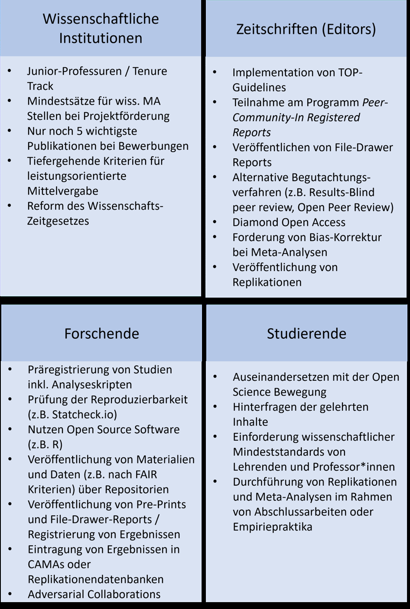

```{=latex}
\markboth{Lösungen}{Lösungen}
```

Werfen wir einen Blick darauf, was sich seit 2012 in den Wissenschaften verändert hat. Viele der diskutierten Entwicklungen stammen dabei aus der Psychologie. Eingeteilt sind die Veränderungen dahingehend, welchen Teil des Problems sie vor allem betreffen: Ist der Zweck einer neuen Vorgabe, das System, die Methodik, oder die Theorien der Forschung zu verbessern? Einige Lösungen sind mit vielen Problemen gleichzeitig verknüpft und manche sind auf bestimmte Angelegenheiten maßgeschneidert. Die Abbildung enthält eine grobe Unterteilung.

::: {.content-visible unless-format="pdf"}
{#fig-lösungsansätze height="85%"}
:::

::: {.content-visible when-format="pdf"}
```{=latex}
\begin{landscape}
```

{#fig-lösungsansätze height="12cm"}

```{=latex}
\end{landscape}
```
:::

------------------------------------------------------------------------
